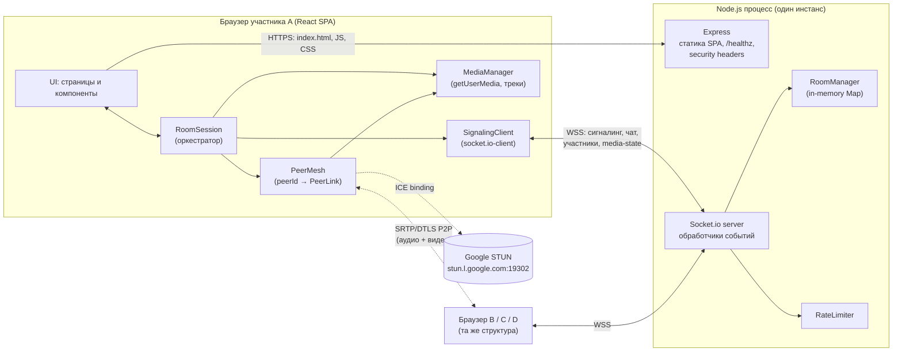
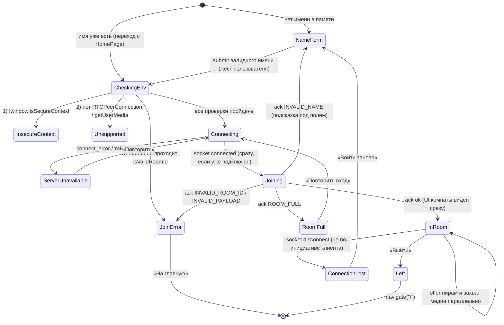
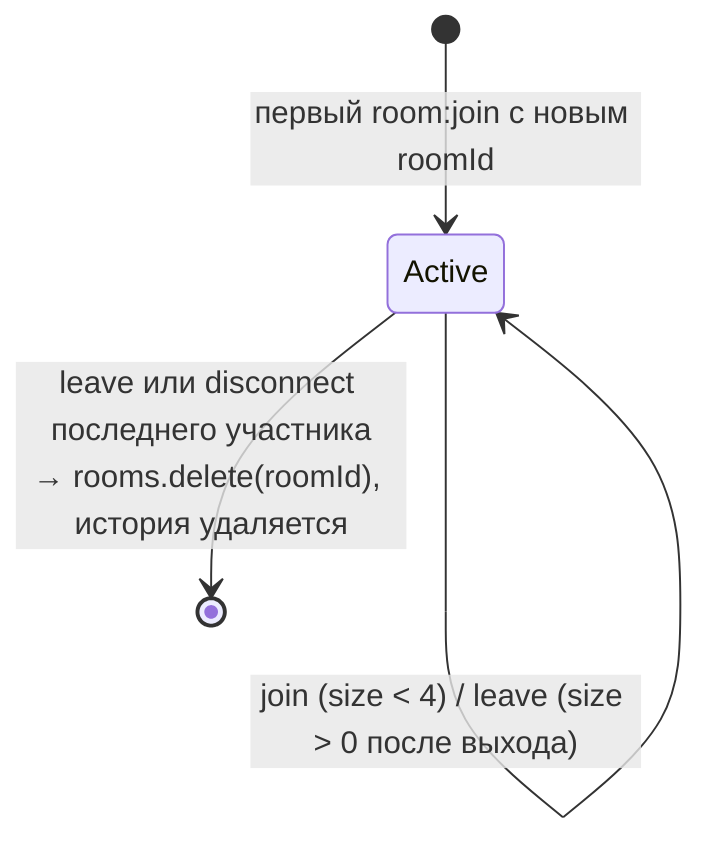
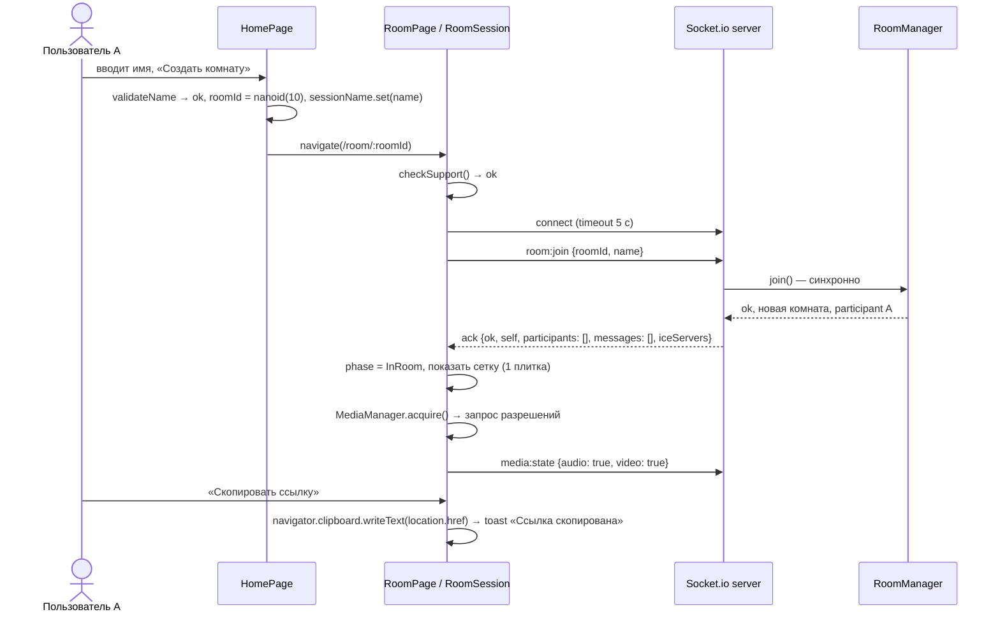
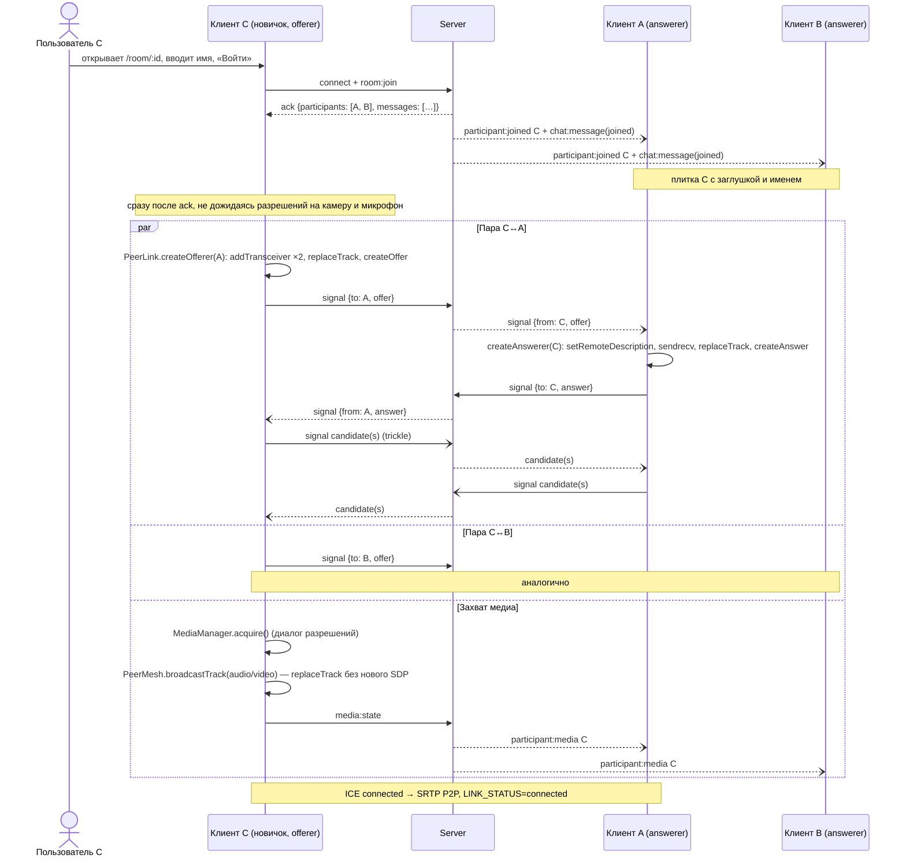
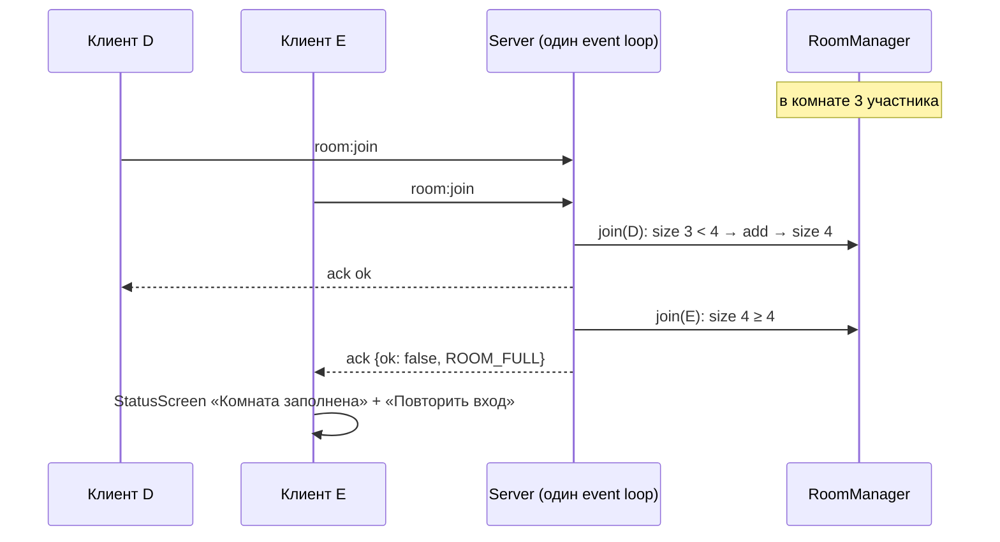
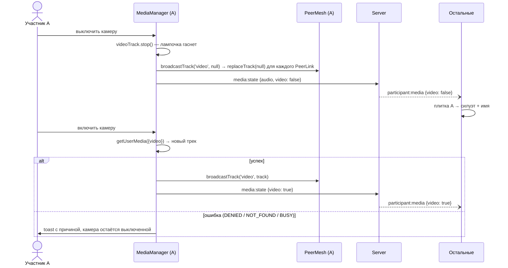
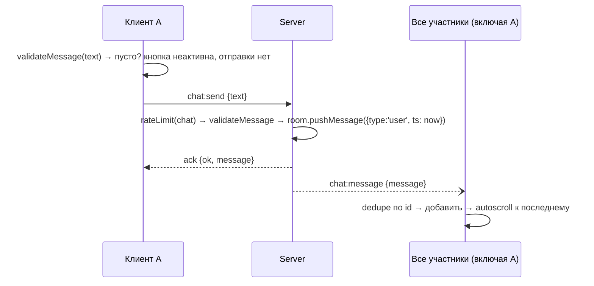
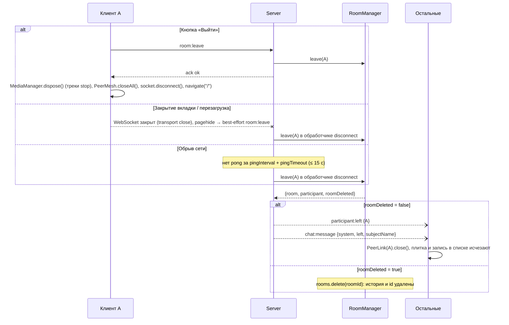

# TDD — Видеочат-комната (Video Chat Room)

|                   |                                                                                         |
| ----------------- | --------------------------------------------------------------------------------------- |
| **Документ**      | Technical Design Document (TDD)                                                         |
| **Версия**        | 1.0                                                                                     |
| **feature-name**  | `video-chat-room`                                                                       |
| **PRD**           | [`prd-video-chat-room.md`](../../prd-video-chat-room.md) (v1.0)                         |
| **Шаблон**        | `prd-design.mdc`                                                                        |
| **Следующий шаг** | Implementation Plan по `prd-tasks.mdc` → `prds/video-chat-room/impl-video-chat-room.md` |

> Документ описывает **как** реализовать PRD. Кода для production здесь нет: фрагменты кода показывают только контракты, сигнатуры и псевдокод. Ссылки вида **FR-n** указывают на пункт n раздела 4 PRD, **US-n** — на user story.

---

## 1. Overview / Контекст

### 1.1 Цель

Веб-приложение для группового видеозвонка до **4 участников** с общим текстовым чатом. Регистрации нет. Вход: открыть ссылку, ввести имя, общаться. Медиа идёт по WebRTC в топологии **mesh (P2P)**. Сигналинг, чат, список участников и системные события идут через **Socket.io**. Состояние хранится **в памяти** одного Node.js-процесса.

### 1.2 Зафиксированные ограничения (из PRD, раздел 7)

| Область   | Решение                                                                          |
| --------- | -------------------------------------------------------------------------------- |
| Язык      | JavaScript (ES6+, ESM), **без TypeScript**                                       |
| UI        | React                                                                            |
| Сервер    | Node.js + Socket.io                                                              |
| Медиа     | WebRTC mesh; при 4 участниках — 6 P2P-соединений на комнату                      |
| NAT-обход | Публичный Google STUN (`stun:stun.l.google.com:19302`); **TURN не используется** |
| Хранилище | Только память сервера. БД нет, на клиенте ничего не сохраняется                  |
| Браузеры  | Chrome / Firefox / Edge 100+, десктоп, ширина экрана от 1024px                   |
| Контекст  | Только защищённый (HTTPS или `localhost`)                                        |

### 1.3 Решения по уточняющим вопросам (раунд 1)

| Вопрос           | Решение                                                                                                                                                                 | Где влияет  |
| ---------------- | ----------------------------------------------------------------------------------------------------------------------------------------------------------------------- | ----------- |
| Деплой           | **Только локально / в LAN.** В разработке — `localhost`. В LAN — HTTPS с сертификатом mkcert. Публичного хостинга нет                                                   | §10, §12    |
| Объём автотестов | **Unit + Integration + E2E.** Vitest, интеграционные тесты Socket.io на реальных сокетах, Playwright с fake media devices                                               | §11         |
| Символы в имени  | **Буквы Unicode, цифры, пробел, `-`, `_`, `.`.** Пробелы по краям обрезаются, повторные схлопываются, максимум 30 символов. Валидация одна и та же на клиенте и сервере | §4, §6, §10 |

### 1.4 Допущения, принятые в дизайне

- Сервер работает **одним процессом** без cluster и без горизонтального масштабирования. На этом держится атомарность проверки лимита (§4.2.2, §13).
- Идентификатор комнаты генерирует **клиент** (nanoid, 10 символов): комната всё равно создаётся при первом `room:join`, поэтому отдельный запрос «создать комнату» не нужен (FR-2, FR-5).
- Имя хранится **только в памяти SPA** (модуль-синглтон или React-state), а не в `history.state` и не в storage. Поэтому после перезагрузки имя нужно ввести снова (FR-28, Non-Goals).
- Смена камеры или микрофона **не вызывает повторного SDP-согласования**: трансиверы создаются один раз, а треки подменяются через `RTCRtpSender.replaceTrack()` (§4.1.4).
- Файл PRD остаётся в корне репозитория. Переносить его в `prds/video-chat-room/` — на усмотрение команды (см. §14).

---

## 2. Current Architecture & Codebase Summary

### 2.1 Состояние репозитория

Проект пишется **с нуля**: коммитов в ветке `main` нет, исходного кода, схем БД и тестов нет. Текущей архитектуры для диаграммы не существует.

### 2.2 Сводка просмотренных файлов

| Путь                     | Тип      | Назначение / ключевые находки                                                                                                                                                                                                                              |
| ------------------------ | -------- | ---------------------------------------------------------------------------------------------------------------------------------------------------------------------------------------------------------------------------------------------------------- |
| `prd-video-chat-room.md` | PRD v1.0 | 13 user stories (US-1…US-13), 40 функциональных требований (FR-1…FR-40), Non-Goals, стек. Ключевое: mesh, лимит 4 с атомарной проверкой, комната удаляется вместе с последним участником, нет автопереподключения, история чата видна тем, кто вошёл позже |
| `prd-design.mdc`         | Правило  | Процесс и обязательная структура TDD (14 разделов), путь сохранения `prds/[feature-name]/design-[feature-name].md`                                                                                                                                         |
| `prd-tasks.mdc`          | Правило  | Формат Implementation Plan: атомарные задачи на 0.25–1 день со ссылками на ID требований PRD и номера разделов TDD. Поэтому в TDD разделы нумеруются стабильно                                                                                             |

### 2.3 Референс

Демо `https://chat.forasoft.com` служит референсом **только по UX и фичам**. Его архитектура (LiveKit SFU + Next.js + Express) **не переносится** (PRD §7, «расхождение с референс-демо»).

---

## 3. Proposed Architecture / High-Level Design

### 3.1 Компонентная схема



**Принцип разделения:**

- **Сервер** — источник истины о _составе комнаты_, _истории чата_ и _состоянии индикаторов микрофона и камеры_. Медиа через сервер не проходит.
- **Клиент** — источник истины о _локальных медиатреках_ и _P2P-соединениях_. Логика WebRTC и сокетов живёт в обычных JS-классах (`services/`) вне React: их можно тестировать без DOM, а React только показывает состояние.

### 3.2 Топология mesh

| Участников | P2P-соединений в комнате | Исходящих видеопотоков на клиента |
| ---------- | ------------------------ | --------------------------------- |
| 1          | 0                        | 0                                 |
| 2          | 1                        | 1                                 |
| 3          | 3                        | 2                                 |
| 4          | 6                        | 3                                 |

**Кто инициирует соединение:** для каждой пары offer отправляет тот, **кто вошёл позже** (по порядку, в котором сервер обработал `room:join`). Новичок получает в ack снимок текущих участников и шлёт offer каждому из них, остальные только отвечают. Так glare (встречные offer) исключён по построению, и паттерн perfect negotiation не нужен.

### 3.3 Структура репозитория

```text
/
├─ package.json                 # npm workspaces: shared, server, client; общие скрипты
├─ shared/                      # @vcr/shared — используется и клиентом, и сервером
│  └─ src/
│     ├─ index.js               # barrel-экспорт пакета
│     ├─ constants.js           # MAX_PARTICIPANTS=4, NAME_MAX_LENGTH=30, MESSAGE_MAX_LENGTH=1000, …
│     ├─ events.js              # имена Socket.io-событий (единый словарь)
│     ├─ errors.js              # коды ошибок (§8)
│     └─ validation.js          # normalizeName, validateName, isValidRoomId, normalizeMessage, validateMessage
├─ server/
│  └─ src/
│     ├─ index.js               # bootstrap: config → http(s) server → Express → Socket.io
│     ├─ config.js              # чтение env с дефолтами (§12.3)
│     ├─ logger.js              # pino; без содержимого чата
│     ├─ http/app.js            # Express: helmet/CSP, static client/dist, /healthz, SPA fallback
│     ├─ rooms/RoomManager.js   # реестр комнат, атомарный join/leave, удаление пустых
│     ├─ rooms/Room.js          # участники, история чата с ограничением длины
│     └─ socket/
│        ├─ registerHandlers.js # подключение обработчиков к io.on('connection')
│        ├─ handlers/room.js    # room:join, room:leave, disconnect
│        ├─ handlers/chat.js    # chat:send
│        ├─ handlers/media.js   # media:state
│        ├─ handlers/signal.js  # signal (relay offer/answer/candidate)
│        ├─ validatePayload.js  # проверка формы входящих payload
│        └─ rateLimiter.js      # token bucket на сокет и тип события
├─ client/
│  ├─ index.html
│  ├─ vite.config.js            # https (mkcert), proxy /socket.io → server (ws: true)
│  └─ src/
│     ├─ main.jsx, App.jsx      # роутинг: "/" и "/room/:roomId"
│     ├─ pages/                 # HomePage, RoomPage
│     ├─ components/            # NameForm, VideoGrid, VideoTile, ControlsBar, ChatPanel, …
│     ├─ services/              # SignalingClient, MediaManager, PeerMesh, PeerLink,
│     │                         # RoomSession, environment (проверки поддержки)
│     ├─ state/                 # roomReducer.js, sessionName.js (имя только в памяти)
│     ├─ hooks/                 # useRoomSession, useAutoScroll, useMediaElement
│     └─ utils/                 # formatTime, gridLayout, clipboard, mediaErrors
├─ e2e/                         # Playwright-сценарии
├─ scripts/                     # load-signaling.js (§11.5)
└─ certs/                       # mkcert-сертификаты для LAN (в .gitignore)
```

### 3.4 Выбор библиотек

| Назначение             | Библиотека                                | Обоснование                                              |
| ---------------------- | ----------------------------------------- | -------------------------------------------------------- |
| Сборка клиента         | Vite 5 + `@vitejs/plugin-react`           | Быстрый dev-сервер, HTTPS и proxy WebSocket «из коробки» |
| Роутинг                | React Router 6                            | Два маршрута, параметр `:roomId`                         |
| Состояние UI           | `useReducer` + Context                    | Состояние небольшое, внешний store не нужен              |
| Сервер HTTP            | Express 4                                 | Статика и `/healthz`                                     |
| Realtime               | Socket.io 4 (server + client)             | Требование стека                                         |
| ID комнаты             | `nanoid` (10 символов, URL-safe алфавит)  | ~64¹⁰ вариантов, короткая ссылка                         |
| ID участника           | `crypto.randomUUID()` (Node)              | Уникален, в UI не показывается (FR-30)                   |
| Заголовки безопасности | `helmet`                                  | CSP, `frame-ancestors`, `Referrer-Policy`                |
| Логи                   | `pino`                                    | Структурированные JSON-логи                              |
| Тесты                  | Vitest, React Testing Library, Playwright | §11                                                      |
| Линт/формат            | ESLint + Prettier                         | Единый стиль                                             |

---

## 4. Components & Interfaces

### 4.1 Клиент

#### 4.1.1 Маршруты и страницы

| Маршрут         | Компонент       | Ответственность                                                                                                                          | Требования             |
| --------------- | --------------- | ---------------------------------------------------------------------------------------------------------------------------------------- | ---------------------- |
| `/`             | `HomePage`      | Форма имени и кнопка «Создать комнату». Генерирует `roomId`, кладёт имя в `sessionName`, переходит на `/room/:roomId`                    | FR-1, FR-2             |
| `/room/:roomId` | `RoomPage`      | Конечный автомат входа (§4.1.2): форма имени, проверка окружения, подключение, `room:join`, захват медиа, экран комнаты или экран ошибки | FR-4…FR-8, FR-33…FR-37 |
| `*`             | редирект на `/` | —                                                                                                                                        | —                      |

Если на `/room/:roomId` в `sessionName` уже есть имя (пользователь пришёл с `HomePage` в рамках той же загрузки SPA), форма имени пропускается и вход начинается сразу. Жестом пользователя для autoplay здесь служит клик «Создать комнату»: sticky activation сохраняется, потому что навигация внутри SPA не перезагружает документ.

#### 4.1.2 Конечный автомат `RoomPage`



**Порядок проверок окружения важен.** На странице, открытой по `http://<LAN-IP>` (незащищённый контекст), браузер не создаёт `navigator.mediaDevices`. Если проверить поддержку WebRTC раньше, пользователь увидит неверное «WebRTC не поддерживается» вместо «Откройте по HTTPS». Поэтому `isSecureContext` проверяется первым.

**Порядок «сначала `room:join`, потом `getUserMedia`»** выбран, чтобы пользователь не выдавал доступ к камере ради того, чтобы увидеть «Комната заполнена» (US-5). Слот резервируется до запроса разрешений. Пока идёт захват медиа, другие участники видят плитку-заглушку с именем.

**Offer пирам не ждёт ответа на запрос разрешений.** Сразу после `JOIN_OK` новичок устанавливает соединения с `null`-треками, а после `acquire()` подставляет треки через `replaceTrack`. Если пользователь долго не отвечает на диалог разрешений или отказывает, он всё равно видит и слышит остальных (FR-14, FR-33).

#### 4.1.3 Сервисы (вне React)

| Класс / модуль    | Ответственность                                                                                                                                                         | Публичный интерфейс (сигнатуры)                                                                                                                                                                                                                               |
| ----------------- | ----------------------------------------------------------------------------------------------------------------------------------------------------------------------- | ------------------------------------------------------------------------------------------------------------------------------------------------------------------------------------------------------------------------------------------------------------- |
| `environment.js`  | Проверка окружения                                                                                                                                                      | `checkSupport(): { ok: true } \| { ok: false, reason: 'WEBRTC_UNSUPPORTED' \| 'INSECURE_CONTEXT' }`                                                                                                                                                           |
| `SignalingClient` | Обёртка `socket.io-client`: подключение без автопереподключения, промисы для ack с таймаутом, подписка по именам из `events.js`                                              | `connect({ timeoutMs }): Promise<void>`; `join(roomId, name): Promise<JoinResult>`; `leave(): Promise<void>`; `sendChat(text): Promise<ChatAck>`; `sendMediaState({audio, video})`; `sendSignal(to, data)`; `on(event, handler): unsubscribe`; `disconnect()` |
| `MediaManager`    | Локальные треки: первичный захват с частичным успехом, выключение микрофона (`enabled=false`), выключение камеры (`track.stop()`) и её перезапуск, отслеживание `ended` | `acquire(): Promise<{ audio: TrackResult, video: TrackResult }>`; `setAudioEnabled(bool)`; `setVideoEnabled(bool): Promise<void>`; `getTrack(kind): MediaStreamTrack \| null`; `onTrackChange(handler)`; `onDeviceLost(handler)`; `dispose()`                 |
| `PeerLink`        | Одно `RTCPeerConnection` к одному удалённому участнику: трансиверы, SDP, очередь ICE-кандидатов, remote `MediaStream`, статус соединения                                | `static createOfferer(peerId, deps)`; `static createAnswerer(peerId, deps)`; `start(): Promise<void>` (offerer); `handleSignal(data): Promise<void>`; `replaceTrack(kind, track): Promise<void>`; `remoteStream: MediaStream`; `onStatus(handler)`; `close()` |
| `PeerMesh`        | Реестр `Map<peerId, PeerLink>`: создание и закрытие по событиям комнаты, маршрутизация входящих `signal`, раздача новых локальных треков всем пирам                     | `connectTo(peerIds[])`; `handleSignal(from, data)`; `removePeer(peerId)`; `broadcastTrack(kind, track)`; `getStream(peerId)`; `closeAll()`                                                                                                                                      |
| `RoomSession`     | Оркестратор одной сессии: связывает Signaling, Media и Mesh, передаёт действия в reducer                                                                                | `start({ roomId, name })`; `toggleMic()`; `toggleCamera()`; `sendMessage(text)`; `leave()`; `getStream(peerId)`; `subscribe(listener)`; `destroy()`                                                                                                                              |

#### 4.1.4 Медиа: трансиверы и тумблеры

**Инициализация `PeerLink`:**

- _Offerer:_ `pc.addTransceiver('audio', { direction: 'sendrecv' })` и `pc.addTransceiver('video', { direction: 'sendrecv' })`. Затем `sender.replaceTrack(localTrack ?? null)`, `createOffer` и `setLocalDescription`.
- _Answerer:_ `setRemoteDescription(offer)`. Для каждого трансивера (вид определяется по `receiver.track.kind`): `direction = 'sendrecv'`, `sender.replaceTrack(localTrack ?? null)`. Затем `createAnswer` и `setLocalDescription`.
- `onnegotiationneeded` **не используется**: согласование проходит ровно один раз на пару.
- Удалённый поток: `new MediaStream(pc.getReceivers().map(r => r.track))` — доступен сразу после `setRemoteDescription`, не приходится ждать `ontrack`.

**Тумблеры (без повторного согласования):**

| Действие                              | Локально                                                              | Для пиров                                       | Сигнал UI                               |
| ------------------------------------- | --------------------------------------------------------------------- | ----------------------------------------------- | --------------------------------------- |
| Выключить микрофон                    | `audioTrack.enabled = false`                                          | Передаётся тишина                               | `media:state { audio: false }`          |
| Включить микрофон                     | `audioTrack.enabled = true`; если трека нет — `getUserMedia({audio})` | Для нового трека `replaceTrack('audio', track)` | `media:state { audio: true }`           |
| Выключить камеру                      | `videoTrack.stop()` — аппаратный индикатор гаснет (FR-19)             | `replaceTrack('video', null)`                   | `media:state { video: false }`          |
| Включить камеру                       | `getUserMedia({ video: VIDEO_CONSTRAINTS })` → новый трек             | `replaceTrack('video', newTrack)`               | `media:state { video: true }`           |
| Устройство потеряно (`track.onended`) | Считать устройство выключенным, показать toast                        | `replaceTrack(kind, null)`                      | `media:state { [kind]: false }` (FR-20) |

`VIDEO_CONSTRAINTS = { width: { ideal: 640 }, height: { ideal: 480 }, frameRate: { ideal: 24, max: 30 } }` — компромисс нагрузки на CPU при кодировании трёх исходящих потоков (§9).

**Первичный захват `acquire()` (частичный успех, FR-14, FR-33):**

1. `enumerateDevices()` → `hasAudioInput`, `hasVideoInput`. Если какого-то устройства нет, оно не запрашивается и считается `NOT_FOUND`.
2. `getUserMedia({ audio: hasAudioInput, video: hasVideoInput && VIDEO_CONSTRAINTS })`. Если устройств нет совсем, вызов не выполняется: `getUserMedia` без запрошенных видов выбрасывает `TypeError`.
3. При ошибке, если запрашивались оба устройства, пробуем их **по отдельности**: так камера, занятая другим приложением, не блокирует микрофон.
4. Результат по каждому виду: `{ status: 'ok' | 'DENIED' | 'NOT_FOUND' | 'BUSY' | 'ERROR', track }`. Соответствие ошибок: `NotAllowedError`/`SecurityError` → `DENIED`, `NotFoundError`/`OverconstrainedError` → `NOT_FOUND`, `NotReadableError`/`AbortError` → `BUSY`.
5. Начальное `media:state` = `{ audio: audio.status === 'ok', video: video.status === 'ok' }`.

#### 4.1.5 UI-компоненты

| Компонент                                   | Ответственность                                                                                                                                              | Props (ключевые)                                                           | Требования                |
| ------------------------------------------- | ------------------------------------------------------------------------------------------------------------------------------------------------------------ | -------------------------------------------------------------------------- | ------------------------- |
| `NameForm`                                  | Поле имени (`maxLength=30`), валидация через `@vcr/shared`, подсказка об ошибке, кнопка submit                                                               | `submitLabel`, `onSubmit(name)`, `busy`                                    | FR-1, FR-38, US-1         |
| `RoomLayout`                                | Сетка + правая панель (ширина 320px), минимальная ширина 1024px                                                                                              | —                                                                          | §6 PRD                    |
| `VideoGrid`                                 | Раскладка 1–4 плиток через `gridLayout(count)`                                                                                                               | `tiles[]`                                                                  | FR-11                     |
| `VideoTile`                                 | `<video autoPlay playsInline>`; оверлей имени; иконка перечёркнутого микрофона; силуэт, если `video=false` или нет кадров; бейдж «Нет медиасоединения»       | `name`, `stream`, `audio`, `video`, `isSelf`, `linkStatus`                 | FR-8, FR-12, FR-16, FR-18 |
| `ControlsBar`                               | Кнопки микрофона, камеры, копирования ссылки и выхода с `aria-pressed`                                                                                       | `audio`, `video`, `onToggleMic`, `onToggleCamera`, `onCopyLink`, `onLeave` | FR-3, FR-15, FR-17, FR-27 |
| `ParticipantList`                           | Имена участников (себя помечает «(Вы)») и иконки состояния                                                                                                   | `participants[]`, `selfId`                                                 | FR-26                     |
| `ChatPanel` → `MessageList`, `MessageInput` | Рендер сообщений **только текстовыми узлами**; системные сообщения выделены стилем; автопрокрутка; запрет пустой отправки; счётчик длины                     | `messages[]`, `onSend(text)`                                               | FR-21…FR-25, FR-39        |
| `AudioUnlockBanner`                         | Показывается, если `video.play()` отклонён с `NotAllowedError`; по клику вызывает `play()` на всех удалённых элементах                                       | `visible`, `onUnlock`                                                      | FR-37                     |
| `StatusScreen`                              | Полноэкранные состояния: `ROOM_FULL`, `SERVER_UNAVAILABLE`, `WEBRTC_UNSUPPORTED`, `INSECURE_CONTEXT`, `CONNECTION_LOST`, `INVALID_ROOM_ID` с действием (повторить / на главную) | `kind`, `onAction`                                                         | FR-8, FR-35, FR-36        |
| `Toasts`                                    | Краткие уведомления: ссылка скопирована, нет доступа к устройству, устройство отключено                                                                      | —                                                                          | FR-3, FR-20, FR-33        |

**Плитка себя (self-view):** всегда **первая** в сетке, с зеркальным отображением (`transform: scaleX(-1)`), `muted`, подписью «Вы» и отличающейся рамкой. Считается одной из 1–4 плиток (FR-11). Альтернатива — PiP, см. §14.

**`gridLayout(count)`** (колонки × ряды): 1 → `1×1`; 2 → `2×1`; 3 → `2×2` (4-я ячейка пустая); 4 → `2×2`. Плитки 16:9, `object-fit: cover`.

#### 4.1.6 Клиентское состояние (`roomReducer`)

```js
/** @typedef {{ id: string, name: string, audio: boolean, video: boolean }} ParticipantView */
/** @typedef {'connecting'|'connected'|'failed'|'closed'} LinkStatus */

const initialState = {
  phase: "nameForm", // см. §4.1.2
  error: null, // код из §8, если phase — экран ошибки
  roomId: null,
  selfId: null,
  participants: [], // ParticipantView[], порядок = порядок входа
  messages: [], // ChatMessage[] (§5.2), не больше CHAT_HISTORY_LIMIT
  local: { audio: false, video: false, audioStatus: null, videoStatus: null },
  links: {}, // { [peerId]: LinkStatus }
  audioLocked: false, // autoplay заблокирован
};
// Действия: PHASE (переходы NameForm → CheckingEnv → Connecting → Joining),
// JOIN_OK, JOIN_FAILED, PARTICIPANT_JOINED, PARTICIPANT_LEFT,
// PARTICIPANT_MEDIA, CHAT_MESSAGE, LOCAL_MEDIA, LINK_STATUS, AUDIO_LOCKED,
// CONNECTION_LOST, LEFT
```

`MediaStream` в reducer **не кладутся** (это не сериализуемые объекты). Компоненты берут их через `RoomSession.getStream(peerId)` или контекст.

### 4.2 Сервер

#### 4.2.1 Модули

| Модуль                       | Ответственность                                                                                                                                                                            | Интерфейс                                                                                                                                                                                                                                                              |
| ---------------------------- | ------------------------------------------------------------------------------------------------------------------------------------------------------------------------------------------ | ---------------------------------------------------------------------------------------------------------------------------------------------------------------------------------------------------------------------------------------------------------------------- |
| `index.js`                   | Собрать конфиг; создать `https.createServer` (если заданы `SSL_KEY_PATH`/`SSL_CERT_PATH`) или `http.createServer`; подключить Express и Socket.io; graceful shutdown по `SIGINT`/`SIGTERM` | —                                                                                                                                                                                                                                                                      |
| `http/app.js`                | `helmet` (CSP §10), `express.static(client/dist)`, `GET /healthz`, SPA fallback `GET *` → `index.html`                                                                                     | `createApp(config): express.Application`                                                                                                                                                                                                                               |
| `rooms/RoomManager.js`       | Реестр комнат; **синхронные** атомарные `join`/`leave`; удаление пустой комнаты                                                                                                            | `join({ roomId, name, socketId }): JoinOutcome`; `leave(participantId): LeaveOutcome \| null`; `getRoomOf(participantId): Room \| null`; `addChatMessage(participantId, text): ChatMessage`; `setMediaState(participantId, state)`; `stats(): { rooms, participants }` |
| `rooms/Room.js`              | Участники (`Map` с порядком вставки), история (кольцевой буфер на `CHAT_HISTORY_LIMIT`)                                                                                                    | `size`, `has(pid)`, `add(p)`, `remove(pid)`, `pushMessage(m)`, `snapshot(excludePid)`                                                                                                                                                                                  |
| `socket/registerHandlers.js` | На `connection`: `socket.data = { participantId: null, roomId: null }`, регистрация обработчиков, обёртка try/catch → `INTERNAL_ERROR`                                                     | `registerHandlers(io, deps)`                                                                                                                                                                                                                                           |
| `socket/handlers/*.js`       | Проверка payload → rate limit → вызов `RoomManager` → emit/ack. Исключение — `signal`: там лимит списывается **до** проверки формы, иначе поток мусорных payload ничем не ограничен (§10.4)                                                                                                                           | `(socket, io, deps) => void`                                                                                                                                                                                                                                           |
| `socket/rateLimiter.js`      | Token bucket по ключу `socketId:bucket`                                                                                                                                                    | `consume(key, bucketName): boolean`                                                                                                                                                                                                                                    |
| `socket/validatePayload.js`  | Проверка формы (типы, длины, лишние поля) без внешних зависимостей                                                                                                                         | `validate(schemaName, payload): { ok, value? , error? }`                                                                                                                                                                                                               |

#### 4.2.2 Атомарность лимита (FR-7, US-5)

Node.js выполняет обработчик события целиком, не переключаясь на другой. Поэтому проверка «< 4» и вставка участника атомарны, **если между ними нет `await`**.

```js
// Псевдокод. Контракт: RoomManager.join синхронен, без await и колбэков внутри.
join({ roomId, name, socketId }) {
  let room = this.rooms.get(roomId);
  if (!room) { room = new Room(roomId); this.rooms.set(roomId, room); }   // FR-5
  if (room.size >= MAX_PARTICIPANTS) return { ok: false, code: 'ROOM_FULL' };
  // комната, созданная выше, всегда пуста, поэтому отказ возможен только для существующей
  const participant = { id: randomUUID(), socketId, name, audio: false, video: false, joinedAt: Date.now() };
  room.add(participant);
  return { ok: true, room, participant };
}
```

Обработчик `room:join` сразу после `RoomManager.join` синхронно вызывает `socket.join(roomId)` (в in-memory adapter Socket.io 4 он синхронный) и рассылает события. Инварианты:

- один сокет — не больше одного участника (`ALREADY_IN_ROOM`);
- нельзя запускать процесс в cluster-режиме или в нескольких инстансах (§13).

#### 4.2.3 Жизненный цикл комнаты (FR-9)



`leave` идемпотентен: `disconnect` после явного `room:leave` ничего не делает.

### 4.3 Shared (`@vcr/shared`)

```js
// constants.js
export const MAX_PARTICIPANTS = 4;
export const NAME_MAX_LENGTH = 30; // в code points
export const MESSAGE_MAX_LENGTH = 1000; // в code points (FR-40, на усмотрение разработчика)
export const CHAT_HISTORY_LIMIT = 200; // сообщений в памяти на комнату
export const ROOM_ID_PATTERN = /^[\p{L}\p{N}._~-]{1,64}$/u; // буквы, цифры и незарезервированные символы URL; nanoid(10) — частный случай
export const NAME_ALLOWED_CHARS = /^[\p{L}\p{N} ._-]+$/u; // допустимый алфавит
export const NAME_HAS_ALNUM = /[\p{L}\p{N}]/u; // хотя бы одна буква или цифра

// validation.js — сигнатуры
export function normalizeName(raw) {} // trim + схлопывание пробелов + NFC
export function validateName(raw) {} // → { ok: true, value } | { ok: false, code: 'NAME_EMPTY'|'NAME_TOO_LONG'|'NAME_INVALID_CHARS' }
export function isValidRoomId(id) {}
export function normalizeMessage(raw) {} // trim, удаление управляющих символов, кроме \n
export function validateMessage(raw) {} // → { ok, value } | { ok: false, code: 'MESSAGE_EMPTY'|'MESSAGE_TOO_LONG' }
```

**Правила имени (решение раунда 1):** после `normalizeName` разрешены только буквы Unicode (`\p{L}`), цифры (`\p{N}`), пробел, `-`, `_`, `.`; длина от 1 до 30 code points; имя обязано содержать хотя бы одну букву или цифру (`"..."` недопустимо). Граничные случаи (эмодзи, комбинируемые диакритики, `<script>`, нулевой ширины пробел) фиксируются unit-тестами (§11). Клиент ограничивает ввод `maxLength=30` (вставка длиннее обрезается, US-1). Сервер **отклоняет** невалидное имя кодом `INVALID_NAME`, а не молча исправляет его.

---

## 5. Data Model & DB Changes

### 5.1 База данных

**БД нет, миграций и SQL нет** (PRD §7, Non-Goals). Все данные живут в памяти процесса и пропадают при удалении комнаты или перезапуске сервера. Изменения схемы БД и индексов: **N/A**.

### 5.2 In-memory модель (сервер)

```js
/**
 * @typedef {Object} Participant
 * @property {string}  id        // crypto.randomUUID(); в UI не показывается (FR-30)
 * @property {string}  socketId
 * @property {string}  name      // нормализованное, валидное (§4.3)
 * @property {boolean} audio     // состояние индикатора (сообщает клиент)
 * @property {boolean} video
 * @property {number}  joinedAt  // epoch ms
 */

/**
 * @typedef {Object} ChatMessage
 * @property {string} id         // randomUUID
 * @property {'user'|'system'} type
 * @property {number} ts         // epoch ms, часы сервера; клиент форматирует HH:MM в локальной TZ (FR-22)
 * @property {string} [authorId]   // только для type='user'
 * @property {string} [authorName] // снимок имени на момент отправки
 * @property {string} [text]       // только для type='user'; сырой нормализованный текст, НЕ HTML
 * @property {'joined'|'left'} [event] // только для type='system'
 * @property {string} [subjectName]    // только для type='system'
 */

/**
 * @typedef {Object} Room
 * @property {string} id
 * @property {Map<string, Participant>} participants  // порядок вставки = порядок входа
 * @property {ChatMessage[]} messages                 // кольцевой буфер, ≤ CHAT_HISTORY_LIMIT
 * @property {number} createdAt
 */

// RoomManager
//   rooms:         Map<roomId, Room>
//   byParticipant: Map<participantId, roomId>   // O(1) для leave/disconnect
```

**Индексы (в памяти):** `rooms` по `roomId`, `byParticipant` по `participantId`. У сокета `socket.data.participantId` и `socket.data.roomId` дают прямую ссылку без поиска.

**Ограничения по памяти:** на комнату приходится не больше 4 участников и 200 сообщений × до 1000 символов, то есть порядка 1 МБ в худшем случае. Лимит на число комнат не вводится (LAN-сценарий); наблюдать размер можно через `/healthz` (§9).

### 5.3 Системные сообщения в истории

Системные сообщения `joined`/`left` **сохраняются в истории** так же, как пользовательские: участник, вошедший позже, видит полную ленту (FR-23, FR-25). Новичку в ack приходит история **без** его собственного `joined`: он сам знает, что вошёл, а остальные получают это сообщение через broadcast.

### 5.4 Клиент

Ничего не сохраняется между загрузками: `localStorage`, `sessionStorage`, IndexedDB, cookies и `history.state` не используются (Non-Goals). Имя живёт в модуле `state/sessionName.js` (переменная модуля), комната — в `roomReducer`.

---

## 6. API / Contracts

### 6.1 HTTP

| Метод | Путь                        | Ответ                                                              | Назначение                         |
| ----- | --------------------------- | ------------------------------------------------------------------ | ---------------------------------- |
| `GET` | `/` , `/room/:roomId`, `/*` | `200 text/html` (`index.html`)                                     | SPA fallback                       |
| `GET` | `/assets/*`                 | статика Vite, `Cache-Control: public, max-age=31536000, immutable` | JS/CSS                             |
| `GET` | `/healthz`                  | `200 {"status":"ok","rooms":3,"participants":7,"uptimeSec":1234,"version":"0.1.0"}`  | Проверка живости и простые метрики |

REST-эндпоинтов для комнат нет: комната создаётся при первом `room:join`.

### 6.2 Socket.io — общие правила

- Namespace `/`, путь `/socket.io`. Клиент подключается так: `io({ autoConnect: false, reconnection: false, timeout: 5000 })`. Транспорты по умолчанию: polling с апгрейдом до WebSocket.
- Сервер: `pingInterval: 5000`, `pingTimeout: 10000`, `maxHttpBufferSize: 64 * 1024`, `connectionStateRecovery` **выключен** (автопереподключения нет, FR-31).
- Запросы от клиента, которым нужен результат, используют **ack** в едином формате:

```js
// Успех
{ ok: true, ...data }
// Ошибка
{ ok: false, error: { code: 'ROOM_FULL', message: 'Комната заполнена' } }
```

- Имена событий — константы из `@vcr/shared/events.js`.
- Все payload проверяются на сервере (§4.2.1). Лишние поля отбрасываются, неверные типы дают `INVALID_PAYLOAD`.

### 6.3 Client → Server

| Событие       | Payload                              | Ack (успех)                                                                                                                                       | Ошибки                                                                              | FR             |
| ------------- | ------------------------------------ | ------------------------------------------------------------------------------------------------------------------------------------------------- | ----------------------------------------------------------------------------------- | -------------- |
| `room:join`   | `{ roomId: string, name: string }`   | `{ ok, self: ParticipantDTO, participants: ParticipantDTO[], messages: ChatMessage[], iceServers: RTCIceServer[], limits: { messageMaxLength } }` | `INVALID_PAYLOAD`, `INVALID_ROOM_ID`, `INVALID_NAME`, `ROOM_FULL`, `ALREADY_IN_ROOM`, `RATE_LIMITED` | 1, 4–8, 23, 30 |
| `room:leave`  | `{}`                                 | `{ ok }`                                                                                                                                          | `NOT_IN_ROOM`                                                                       | 27             |
| `chat:send`   | `{ text: string }`                   | `{ ok, message: ChatMessage }`                                                                                                                    | `NOT_IN_ROOM`, `MESSAGE_EMPTY`, `MESSAGE_TOO_LONG`, `RATE_LIMITED`                  | 21, 24, 40     |
| `media:state` | `{ audio: boolean, video: boolean }` | без ack                                                                                                                                           | молча игнорируется, если сокет не в комнате                                         | 15, 16, 18     |
| `signal`      | `{ to: string, data: SignalData }`   | без ack                                                                                                                                           | `signal:error { to, code: 'PEER_NOT_FOUND' \| 'INVALID_SIGNAL' \| 'RATE_LIMITED' }` | 10             |

```js
/** @typedef {{ id: string, name: string, audio: boolean, video: boolean }} ParticipantDTO */
/** @typedef {
 *   { type: 'offer',     sdp: string } |
 *   { type: 'answer',    sdp: string } |
 *   { type: 'candidate', candidate: RTCIceCandidateInit | null }   // null = end-of-candidates
 * } SignalData */
```

`participants` в ack `room:join` перечисляет **других** участников в порядке входа. Этим списком новичок пользуется как списком пиров, которым нужно отправить offer (§3.2).

### 6.4 Server → Client

| Событие              | Payload                                                     | Кому                                                           | Когда                          |
| -------------------- | ----------------------------------------------------------- | -------------------------------------------------------------- | ------------------------------ |
| `participant:joined` | `{ participant: ParticipantDTO }`                           | комнате, кроме нового участника                                | после успешного `room:join`    |
| `participant:left`   | `{ participantId: string }`                                 | комнате                                                        | `room:leave` / `disconnect`    |
| `participant:media`  | `{ participantId: string, audio: boolean, video: boolean }` | комнате, кроме отправителя                                     | `media:state`                  |
| `chat:message`       | `{ message: ChatMessage }`                                  | комнате, **включая** отправителя пользовательского сообщения\* | `chat:send`, системные события |
| `signal`             | `{ from: string, data: SignalData }`                        | одному участнику `to`                                          | relay                          |
| `signal:error`       | `{ to: string, code: string }`                              | отправителю                                                    | ошибка relay                   |

\* Отправитель получает своё сообщение и в ack, и в broadcast. Клиент устраняет дубликаты по `message.id`, поэтому достаточно отрисовки из одного источника (из broadcast). Ack нужен, чтобы подтвердить отправку и показать ошибку.

### 6.5 Примеры

**Успешный вход во вторую позицию:**

```jsonc
// → room:join
{ "roomId": "V1StGXR8_Z", "name": "Алекс" }

// ← ack
{
  "ok": true,
  "self": { "id": "b7c1…", "name": "Алекс", "audio": false, "video": false },
  "participants": [
    { "id": "4f2a…", "name": "Мария", "audio": true, "video": true }
  ],
  "messages": [
    { "id": "m1", "type": "system", "event": "joined", "subjectName": "Мария", "ts": 1789640000000 },
    { "id": "m2", "type": "user", "authorId": "4f2a…", "authorName": "Мария", "text": "Всем привет <b>!</b>", "ts": 1789640012000 }
  ],
  "iceServers": [{ "urls": "stun:stun.l.google.com:19302" }],
  "limits": { "messageMaxLength": 1000 }
}

// ← participant:joined (у Марии)
{ "participant": { "id": "b7c1…", "name": "Алекс", "audio": false, "video": false } }
// ← chat:message (у Марии)
{ "message": { "id": "m3", "type": "system", "event": "joined", "subjectName": "Алекс", "ts": 1789640030000 } }
```

**Пятый участник:**

```jsonc
// → room:join
{ "roomId": "V1StGXR8_Z", "name": "Пётр" }
// ← ack
{ "ok": false, "error": { "code": "ROOM_FULL", "message": "Комната заполнена" } }
```

**Relay SDP:**

```jsonc
// → signal (от b7c1)
{ "to": "4f2a…", "data": { "type": "offer", "sdp": "v=0\r\no=- 4611… 2 IN IP4 127.0.0.1\r\n…" } }
// ← signal (у 4f2a)
{ "from": "b7c1…", "data": { "type": "offer", "sdp": "v=0\r\n…" } }
```

Сервер пересылает `signal`, **только если** `to` состоит в той же комнате, что и отправитель. `from` проставляет сервер: клиент не может его подменить.

---

## 7. Data & Control Flows

### 7.1 Создание комнаты (US-1, US-2, US-3)



### 7.2 Вход в существующую комнату и mesh-согласование (US-4, US-6)



**Правила обработки сигналов в `PeerLink`:**

1. Кандидаты, пришедшие до завершения `setRemoteDescription`, кладутся в очередь, а после применения описания добавляются по порядку.
2. `signal` от `from`, которого нет в `participants`, игнорируется (участник уже вышел).
3. Повторный offer от пира, для которого `PeerLink` уже есть, по протоколу невозможен (согласование на пару одно), но обрабатывается защитно: старый link закрывается и создаётся новый answerer.
4. Если соединение не дошло до `connected` за 15 с или `connectionState === 'failed'` → `LINK_STATUS=failed`, плитка показывает бейдж «Нет медиасоединения», звонок остальных не затрагивается (FR-34). Автоповтор не выполняется (§14).

### 7.3 Гонка за последний слот (US-5)



Второй `join` не может начаться, пока первый обработчик не закончил синхронную часть, поэтому гонки нет.

### 7.4 Тумблер камеры (US-7)



### 7.5 Отправка сообщения (US-8)



**Автопрокрутка:** при каждом новом сообщении (своём, чужом или системном) `MessageList` прокручивает ленту к последнему сообщению, как требуют FR-23 и US-8. Вариант «не прокручивать, пока пользователь читает историю» противоречит критерию приёмки US-8 и вынесен в §14 (Q-6) как возможное изменение PRD.

### 7.6 Выход, закрытие вкладки, обрыв, удаление комнаты (US-10, US-11)



Если WebRTC-соединение с A упало раньше, чем сервер заметил обрыв сокета, у остальных плитка A временно показывает бейдж «Нет медиасоединения». Плитка исчезает по `participant:left`. Отдельная формулировка «соединение потеряно» в чат **не пишется** (FR-31).

**Потеря сокета у самого клиента:** `disconnect` с причиной, отличной от `io client disconnect`, → `phase = ConnectionLost`. Клиент останавливает треки, закрывает mesh и показывает «Соединение с сервером потеряно» с кнопкой «Войти заново» (новый вход, FR-31).

---

## 8. Error Handling & Edge Cases

### 8.1 Коды ошибок сервера (ack / `signal:error`)

| Код                | Текст для UI (RU)                                                           | Причина                                | Поведение клиента                        |
| ------------------ | --------------------------------------------------------------------------- | -------------------------------------- | ---------------------------------------- |
| `INVALID_PAYLOAD`  | «Некорректный запрос»                                                       | Неверная форма payload                 | Лог в консоль, toast                     |
| `INVALID_ROOM_ID`  | «Некорректная ссылка на комнату»                                            | `roomId` не проходит `ROOM_ID_PATTERN` | `StatusScreen` с кнопкой «На главную»    |
| `INVALID_NAME`     | «Имя может содержать буквы, цифры, пробел, «-», «\_», «.» (до 30 символов)» | Валидация на сервере (обход клиента)   | Вернуть на `NameForm` с подсказкой       |
| `ROOM_FULL`        | «Комната заполнена»                                                         | Уже 4 участника                        | `StatusScreen` + «Повторить вход» (FR-8) |
| `ALREADY_IN_ROOM`  | —                                                                           | Повторный `room:join` с того же сокета | Игнорировать (защита от двойного клика)  |
| `NOT_IN_ROOM`      | —                                                                           | `chat:send` / `room:leave` без входа   | Игнорировать                             |
| `MESSAGE_EMPTY`    | —                                                                           | Пустое сообщение после нормализации    | Кнопка «Отправить» уже неактивна         |
| `MESSAGE_TOO_LONG` | «Сообщение длиннее 1000 символов»                                           | Обход `maxLength`                      | Toast, текст в поле сохраняется          |
| `RATE_LIMITED`     | «Слишком часто, подождите немного»                                          | Сработал token bucket (§10.4)          | Toast, текст в поле сохраняется          |
| `PEER_NOT_FOUND`   | —                                                                           | `to` не в комнате (успел выйти)        | Закрыть `PeerLink` для `to`              |
| `INVALID_SIGNAL`   | —                                                                           | Неверный `SignalData`                  | Лог, пометить link как `failed`          |
| `INTERNAL_ERROR`   | «Внутренняя ошибка сервера»                                                 | Исключение в обработчике               | Toast; сервер пишет `error` в лог        |

### 8.2 Клиентские состояния ошибок

| Код                  | Детектирование                                                         | Реакция                                                                                                                                      | FR     |
| -------------------- | ---------------------------------------------------------------------- | -------------------------------------------------------------------------------------------------------------------------------------------- | ------ |
| `WEBRTC_UNSUPPORTED` | `!window.RTCPeerConnection \|\| !navigator.mediaDevices?.getUserMedia` | `StatusScreen`: «Ваш браузер не поддерживает WebRTC. Используйте Chrome, Firefox или Edge версии 100+»                                       | 36     |
| `INSECURE_CONTEXT`   | `!window.isSecureContext` (открыто по `http://192.168…`)               | `StatusScreen`: «Откройте приложение по HTTPS» + ссылка на `https://` версию                                                                 | PRD §7 |
| `SERVER_UNAVAILABLE` | `connect_error` или таймаут 5 с                                        | `StatusScreen`: «Сервер недоступен» + «Повторить»                                                                                            | 35     |
| `CONNECTION_LOST`    | `disconnect` с `reason ≠ 'io client disconnect'` в фазе `InRoom`       | `StatusScreen` + «Войти заново»                                                                                                              | 31     |
| `MEDIA_DENIED`       | `acquire()` → `DENIED`                                                 | Toast «Нет доступа к камере/микрофону. Разрешите доступ в настройках браузера»; кнопка устройства выключена; пользователь остаётся в комнате | 33     |
| `MEDIA_NOT_FOUND`    | `NOT_FOUND`                                                            | Кнопка устройства выключена, tooltip «Устройство не найдено»                                                                                 | 14     |
| `MEDIA_BUSY`         | `acquire()` / `setVideoEnabled()` → `BUSY`                             | Toast «Камера используется другим приложением»                                                                                               | 20     |
| `MEDIA_DEVICE_LOST`  | `track.onended` во время звонка                                        | Toast «Устройство отключено»; `media:state` → off                                                                                            | 20     |
| `PEER_LINK_FAILED`   | `connectionState='failed'` или нет `connected` за 15 с                 | Бейдж на плитке «Нет медиасоединения»; остальное работает                                                                                    | 34     |
| `AUTOPLAY_BLOCKED`   | `videoEl.play()` → `NotAllowedError`                                   | `AudioUnlockBanner` «Включить звук»                                                                                                          | 37     |
| `CLIPBOARD_FAILED`   | `clipboard.writeText` rejected                                         | Fallback: выделенное поле со ссылкой + «Скопируйте вручную»                                                                                  | 3      |

Проверки `INSECURE_CONTEXT` → `WEBRTC_UNSUPPORTED` выполняются строго в этом порядке (§4.1.2): в незащищённом контексте `navigator.mediaDevices` отсутствует даже в поддерживаемом браузере.

### 8.3 Крайние случаи

| Сценарий                                               | Решение                                                                                                                                  |
| ------------------------------------------------------ | ---------------------------------------------------------------------------------------------------------------------------------------- |
| Двойной клик «Войти»                                   | Кнопка блокируется на время `Joining`; повторный `room:join` на сервере → `ALREADY_IN_ROOM`                                              |
| Две вкладки одного пользователя                        | Два сокета — два участника, два слота (FR-29). Специальной обработки нет                                                                 |
| Одинаковые имена                                       | Различаются по `participantId`; React-ключи — `id` (FR-30)                                                                               |
| Вход по URL несуществующей комнаты                     | Комната создаётся (FR-5); UI не отличается от обычного входа                                                                             |
| URL с недопустимым `roomId` (например, `/room/<script>` или длиннее 64 символов) | `INVALID_ROOM_ID` → экран «Некорректная ссылка». Клиент проверяет и до подключения (§14, Q-2)                                                |
| Последний участник вышел, кто-то входит по тому же id  | Создаётся новая пустая комната, история пуста (FR-9)                                                                                     |
| Участник вышел во время SDP-согласования               | `participant:left` → `PeerLink.close()`; поздние `signal` игнорируются, `signal:error PEER_NOT_FOUND`                                    |
| Два новичка входят одновременно                        | Порядок задаёт сервер: второй получает первого в ack и сам шлёт ему offer; первый получает `participant:joined` и ждёт. Glare невозможен |
| Разрешение на медиа ещё не дано, а offer уже пришёл    | Answerer отвечает с `replaceTrack(null)`; после `acquire()` вызывается `broadcastTrack` без повторного согласования                      |
| Нет ни камеры, ни микрофона                            | Трансиверы `sendrecv` с `null`-треками; участник видит и слышит других (FR-14)                                                           |
| Недоступен STUN                                        | В LAN достаточно host-кандидатов (в т. ч. mDNS `.local`); `iceServers` в конфиге, ошибка STUN не блокирует UI (FR-34)                    |
| Строгий NAT между сетями                               | Пара не соединяется → `PEER_LINK_FAILED`; допустимо по PRD (TURN вне scope)                                                              |
| XSS в имени или сообщении                              | Имя отсекается валидацией; текст рендерится как текстовый узел React; `dangerouslySetInnerHTML` запрещён правилом ESLint (§10.3)         |
| Пустое сообщение из пробелов/переводов строк           | `validateMessage` → `MESSAGE_EMPTY` (клиент и сервер)                                                                                    |
| Перезагрузка страницы                                  | Сокет закрыт → `leave`; имени в памяти нет → `NameForm` (FR-28)                                                                          |
| Сервер перезапустился во время звонка                  | У всех `CONNECTION_LOST`; все комнаты исчезли (данные в памяти) — ожидаемо                                                               |
| Спящий ноутбук / вкладка в фоне                        | Если ping не прошёл — участника исключает сервер, клиент при пробуждении видит `CONNECTION_LOST`                                         |

---

## 9. Performance & Scalability

### 9.1 Целевые метрики

| Метрика                                                      | Цель                                                    | Как измеряем                                                                                                                                                                                                                         |
| ------------------------------------------------------------ | ------------------------------------------------------- | ------------------------------------------------------------------------------------------------------------------------------------------------------------------------------------------------------------------------------------ |
| Задержка медиа glass-to-glass в LAN                          | **≤ 500 мс** (US-6)                                     | Ручной тест: секундомер с миллисекундами на экране A снимается камерой A, сравнивается с отображением у B; дополнительно `getStats()`: `candidate-pair.currentRoundTripTime` + `inbound-rtp.jitterBufferDelay / jitterBufferEmitted` |
| Клик «Войти» → UI комнаты (без учёта диалога разрешений)     | ≤ 1 с в LAN                                             | `performance.mark` в dev-сборке                                                                                                                                                                                                      |
| `room:join` ack → `connectionState=connected` для пары       | ≤ 3 с p95 в LAN                                         | Playwright E2E с таймингами                                                                                                                                                                                                          |
| Доставка сообщения чата                                      | ≤ 300 мс в LAN                                          | Интеграционный тест: `ts` отправки против получения                                                                                                                                                                                  |
| Исчезновение плитки: «Выйти» / закрытие вкладки / обрыв сети | ≤ 1 с / ≤ 2 с / ≤ 15 с                                  | E2E; для обрыва — `pingInterval 5 с + pingTimeout 10 с`                                                                                                                                                                              |
| Сервер: память при 50 комнатах × 4 участника                 | < 150 МБ RSS                                            | Скрипт нагрузки только на сигналинге (§11.5)                                                                                                                                                                                         |
| Клиент: CPU при 4 участниках                                 | Без `qualityLimitationReason='cpu'` на типовом ноутбуке | `getStats()` → `outbound-rtp.qualityLimitationReason` (лог в dev)                                                                                                                                                                    |

### 9.2 Нагрузка mesh на клиента

При 4 участниках каждый клиент кодирует **3 исходящих** видеопотока и декодирует 3 входящих. Меры:

- Захват в `640×480@24` (ideal), без апскейла.
- Потолок битрейта **не задаётся** (PRD Non-Goals). Если на слабых машинах `qualityLimitationReason` окажется `cpu` или `bandwidth`, можно ограничить `RTCRtpSender.setParameters({ encodings: [{ maxBitrate: 800_000 }] })` — это вариант на будущее (§13, R-2).
- Аудио: Opus по умолчанию, `echoCancellation`, `noiseSuppression`, `autoGainControl` включены (дефолты браузера).
- Нет активного говорящего и нет анализа аудио (Non-Goals), дополнительной нагрузки нет.

### 9.3 Сервер

- Медиа через сервер не идёт, так что нагрузка — это только сигналинг и чат: единицы сообщений в секунду на комнату, всплеск ICE-кандидатов при входе (десятки сообщений).
- **Кеш-слоёв и очередей нет** — не нужны: состояние уже в памяти, операции O(1).
- **Горизонтальное масштабирование не поддерживается** (один процесс, §1.4). Путь на будущее: Redis adapter + sticky sessions + атомарный лимит в Redis (Lua/`INCR`). Вне scope этого TDD.

---

## 10. Security & Compliance

### 10.1 AuthN / AuthZ

- **Аутентификации нет** (Non-Goals). Идентичность — это сокет; `participantId` выдаёт сервер.
- **Авторизация на уровне событий:**
  - `chat:send`, `media:state`, `signal`, `room:leave` разрешены, только если `socket.data.roomId` задан;
  - `signal` пересылается только участнику **той же** комнаты; поле `from` проставляет сервер;
  - `participant:media` и `chat:message` рассылаются в комнату отправителя, id комнаты берётся из `socket.data`, не из payload;
  - у создателя комнаты прав не больше, чем у остальных (FR-32).
- Угадывание `roomId` — штатное поведение (FR-6). Энтропия nanoid(10) (~60 бит) защищает от **случайного** попадания в чужую комнату, но это не механизм безопасности.

### 10.2 Шифрование и транспорт

| Канал             | Защита                                                       |
| ----------------- | ------------------------------------------------------------ |
| HTML/JS           | HTTPS (mkcert в LAN, `localhost` в dev)                      |
| Сигналинг и чат   | WSS поверх того же TLS                                       |
| Медиа             | DTLS-SRTP (обязательно в WebRTC); E2EE сверх этого вне scope |
| Данные на сервере | В памяти, не пишутся на диск                                 |

### 10.3 Защита от XSS и инъекций (FR-38, FR-39)

1. **Валидация на входе (сервер — источник истины):** имя проверяется по §4.3, текст — `validateMessage` (длина, удаление управляющих символов `\p{Cc}` кроме `\n`, а также `U+202A..U+202E`, `U+2066..U+2069` для защиты от bidi-спуфинга).
2. **Экранирование на выходе:** имена и тексты выводятся только как `{text}` в JSX. `dangerouslySetInnerHTML` и `innerHTML` запрещены правилами `react/no-danger` и `no-restricted-properties`. В чате ссылки **не** превращаются в кликабельные (§14).
3. **CSP** (helmet):

```text
default-src 'self';
script-src 'self';
style-src 'self' 'unsafe-inline';
img-src 'self' data:;
media-src 'self' blob: mediastream:;
connect-src 'self';
frame-ancestors 'none';
base-uri 'self';
object-src 'none';
```

`connect-src 'self'` достаточно для Socket.io: по CSP Level 3 `'self'` разрешает и `ws:`/`wss:` на тот же хост и порт (Chrome, Firefox, Edge 100+). Разрешение `ws:`/`wss:` на любые хосты не нужно: при XSS оно открыло бы канал утечки данных.

4. `Permissions-Policy: camera=(self), microphone=(self), display-capture=()`; `Referrer-Policy: no-referrer` (ссылка на комнату не утекает через Referer).

### 10.4 Защита от злоупотреблений (FR-40)

| Bucket                  | Лимит (token bucket на сокет)                   | При превышении              |
| ----------------------- | ----------------------------------------------- | --------------------------- |
| `join`                  | 5 попыток / 10 с                                | ack `RATE_LIMITED`          |
| `chat`                  | 5 сообщений / 5 с (burst 5)                     | ack `RATE_LIMITED`          |
| `media`                 | 20 / 10 с                                       | молча игнорировать          |
| `signal`                | 300 / 10 с (хватает на ICE-всплеск при 3 пирах) | `signal:error RATE_LIMITED` |
| Размер фрейма           | `maxHttpBufferSize` 64 КБ (SDP ~5–10 КБ)        | сокет отключается Socket.io |
| Подключения с одного IP | Не ограничиваются (LAN)                         | — (§14)                     |

### 10.5 Приватность / GDPR / PII

- PII: отображаемое имя и текст сообщений. Хранятся **только в памяти**, удаляются вместе с комнатой (FR-9). На клиенте ничего не сохраняется.
- **Логи:** `roomId`, `participantId`, коды событий и ошибок. **Не** логируются текст сообщений, SDP и ICE-кандидаты (в них IP-адреса); имя — только на уровне `debug`.
- Приложение для LAN и тестового задания: cookie-баннер и DPA не требуются. При публичном деплое вопрос нужно пересмотреть (§14).
- IP-адреса в ICE-кандидатах видны пирам (природа P2P). Chrome по умолчанию маскирует host-адреса через mDNS.

---

## 11. Testing Strategy

Объём (решение раунда 1): **Unit + Integration + E2E**, плюс ручной чек-лист для того, что не автоматизируется (реальные устройства, кросс-браузер, задержка).

### 11.1 Пирамида и инструменты

| Уровень       | Инструменты                                                                | Окружение                                            | Где лежит                           |
| ------------- | -------------------------------------------------------------------------- | ---------------------------------------------------- | ----------------------------------- |
| Unit          | Vitest                                                                     | Node (shared, server), jsdom (client utils, reducer) | `*/src/**/*.test.js`                |
| Component     | Vitest + React Testing Library + jsdom                                     | Моки `SignalingClient` / `MediaManager`              | `client/src/**/*.test.jsx`          |
| Integration   | Vitest + реальный Socket.io-сервер на эфемерном порту + `socket.io-client` | Node                                                 | `server/test/integration/*.test.js` |
| E2E           | Playwright (Chromium, fake media)                                          | `vite build --mode test` + сервер на `localhost`     | `e2e/*.spec.js`                     |
| Load (лёгкий) | Node-скрипт на `socket.io-client`                                          | Локально                                             | `scripts/load-signaling.js`         |

### 11.2 Unit / Component — ключевые кейсы

| Модуль              | Кейсы                                                                                                                                                                                                                                                                                                                                          |
| ------------------- | ---------------------------------------------------------------------------------------------------------------------------------------------------------------------------------------------------------------------------------------------------------------------------------------------------------------------------------------------- |
| `shared/validation` | Имя: пустое/пробелы → `NAME_EMPTY`; 30 и 31 code point; кириллица, латиница, `ё`, цифры, `-_.`; эмодзи, `<script>`, `'`, `"`, `/`, zero-width space → `NAME_INVALID_CHARS`; `"..."` → invalid; схлопывание пробелов; NFC. Сообщение: пустое/пробельное, 1000/1001, bidi и управляющие символы. `roomId`: граничные длины, недопустимые символы |
| `RoomManager`       | Создание при первом входе; 4 входят, 5-й → `ROOM_FULL`; leave последнего → комната удалена; повторный вход по id → пустая история; идемпотентный `leave`; `byParticipant` консистентен; одинаковые имена — разные id                                                                                                                           |
| `Room`              | Кольцевой буфер: 201-е сообщение вытесняет первое; `snapshot(excludePid)`                                                                                                                                                                                                                                                                      |
| `rateLimiter`       | Burst, пополнение токенов (fake timers), изоляция по ключам                                                                                                                                                                                                                                                                                    |
| `validatePayload`   | Лишние поля отброшены, неверные типы, `SignalData` всех трёх видов, `candidate: null`                                                                                                                                                                                                                                                          |
| `roomReducer`       | Все действия §4.1.6; дедупликация сообщений по `id`; порядок участников                                                                                                                                                                                                                                                                        |
| `utils`             | `formatTime` → `HH:MM` в заданной TZ (фиксируется через `TZ` env); `gridLayout(1..4)`; `mapMediaError` для каждого `DOMException.name`                                                                                                                                                                                                         |
| `MediaManager`      | Мок `navigator.mediaDevices`: частичный успех (видео `NotReadableError`, аудио ok); `setVideoEnabled(false)` вызывает `track.stop()`; `ended` → `onDeviceLost`                                                                                                                                                                                 |
| `PeerLink`          | Мок `RTCPeerConnection`: очередь кандидатов до `setRemoteDescription`; answerer ставит `sendrecv`; `replaceTrack(null)`; таймаут 15 с → `failed` (fake timers)                                                                                                                                                                                 |
| `NameForm`          | Подсказка при пустом имени, `maxLength=30`, submit блокируется при `busy`                                                                                                                                                                                                                                                                      |
| `ChatPanel`         | `""` отображается текстом, в DOM нет `img`; пустое сообщение не отправляется; автопрокрутка к последнему сообщению при каждом новом сообщении (US-8)                                                                                                                                                              |
| `VideoTile`         | `video=false` → силуэт + имя; `audio=false` → иконка перечёркнутого микрофона; `linkStatus='failed'` → бейдж                                                                                                                                                                                                                                   |

### 11.3 Integration (сервер, реальные сокеты)

| #    | Сценарий                                                     | Проверки                                                                                                                                                  | FR / US   |
| ---- | ------------------------------------------------------------ | --------------------------------------------------------------------------------------------------------------------------------------------------------- | --------- |
| I-1  | A и B входят в одну комнату                                  | ack A: `participants=[]`; ack B: `[A]`; A получает `participant:joined B` и `chat:message joined`                                                         | 4, 25, 26 |
| I-2  | 4 входят, 5-й пытается                                       | 5-й получает `ROOM_FULL`; остальные событий не получают                                                                                                   | 7, 8      |
| I-3  | Гонка: 3 в комнате, `Promise.all` из 2 `join` (×50 итераций) | Ровно один `ok`, один `ROOM_FULL`; `size === 4`                                                                                                           | 7, US-5   |
| I-4  | Чат и история                                                | B отправляет → A и B получают `chat:message`; C входит позже → в ack есть сообщение B и системные                                                         | 21, 23    |
| I-5  | Невалидные входы                                             | Имя `"<b>"`, 31 символ, пустое; `roomId` `"../x"`; `chat:send` без входа; payload-не-объект                                                               | 38, 24    |
| I-6  | `room:leave` и `disconnect`                                  | Остальные получают `participant:left` + `chat:message left`; повторный `disconnect` без дублей                                                            | 27, 31    |
| I-7  | Удаление комнаты                                             | Все вышли → `stats().rooms === 0`; вход по тому же id → `messages=[]`                                                                                     | 9         |
| I-8  | Relay сигналов                                               | `signal` A→B доставлен с `from=A`; A→участник другой комнаты → `PEER_NOT_FOUND`, получатель ничего не получает; подменённый `from` в payload игнорируется | 10, §10.1 |
| I-9  | Rate limit                                                   | 6 сообщений подряд → 6-е `RATE_LIMITED`                                                                                                                   | 40        |
| I-10 | `media:state`                                                | B получает `participant:media` от A; C, вошедший позже, видит актуальные `audio/video` в ack                                                              | 15, 16    |
| I-11 | Двойной `room:join` с одного сокета                          | `ALREADY_IN_ROOM`, слот не занят дважды                                                                                                                   | 29        |

### 11.4 E2E (Playwright, Chromium)

Запуск Chromium с флагами `--use-fake-ui-for-media-stream --use-fake-device-for-media-stream`. Каждый участник — отдельный `browserContext`. Хелпер `waitForPeerConnected(page, n)` через `page.evaluate` читает статусы из dev-хука `window.__vcr` (есть только при `import.meta.env.MODE === 'test'`, поэтому клиент для E2E собирается командой `vite build --mode test`; обычная сборка хук не содержит).

| #    | Сценарий                                            | Ожидания                                                                                                                  | US     |
| ---- | --------------------------------------------------- | ------------------------------------------------------------------------------------------------------------------------- | ------ |
| E-1  | A создаёт комнату, копирует ссылку, B входит по ней | URL `/room/<id>`; toast «Ссылка скопирована»; у обоих 2 плитки, имена в оверлеях; `videoWidth > 0` у удалённого `<video>` | 1–4, 6 |
| E-2  | Пустое имя                                          | Кнопка не ведёт в комнату, подсказка видна                                                                                | 1      |
| E-3  | 4 участника + 5-й                                   | 5-й видит «Комната заполнена»; после выхода одного «Повторить вход» успешен                                               | 5      |
| E-4  | Тумблеры                                            | A выключает микрофон → у B иконка; A выключает камеру → у B силуэт; у A `videoTrack.readyState === 'ended'`               | 7      |
| E-5  | Чат                                                 | Сообщение с HTML появляется у всех как текст, формат `HH:MM`; C входит позже и видит историю                              | 8      |
| E-6  | Выход и закрытие вкладки                            | «Выйти» → плитка исчезает у B, системное сообщение; `page.close()` у C → то же                                            | 9, 10  |
| E-7  | Отказ в доступе                                     | `addInitScript` подменяет `getUserMedia` → `NotAllowedError`; пользователь в комнате, toast, кнопки выключены             | 12     |
| E-8  | Нет WebRTC                                          | `addInitScript`: `delete window.RTCPeerConnection` → экран «WebRTC не поддерживается»                                     | 13     |
| E-9  | Сервер недоступен                                   | `page.routeWebSocket(/socket\.io/, ws => ws.close())` + `page.route('**/socket.io/**', r => r.abort())` (WebSocket не перехватывается `page.route`, нужен Playwright ≥ 1.48) → экран «Сервер недоступен»                                        | 13     |
| E-10 | Перезагрузка                                        | `page.reload()` → форма имени; у других участник вышел                                                                    | 10     |

Кросс-браузерные E2E (Firefox) — опционально: у Firefox своя механика fake media (`media.navigator.streams.fake`). В CI по умолчанию только Chromium.

### 11.5 Load (лёгкий, опционально)

`scripts/load-signaling.js`: 50 комнат × 4 сокета, по каждому участнику 20 сообщений чата и 30 фиктивных `signal`. Критерии: ни одного ответа `ROOM_FULL` при ровно 4 участниках, RSS < 150 МБ, p95 доставки чата < 50 мс (localhost). Полноценный нагрузочный тест медиа не нужен: медиа идёт P2P.

### 11.6 Ручной чек-лист (перед сдачей)

- [ ] Chrome, Firefox, Edge (100+): вход, видео и звук в обе стороны.
- [ ] 4 реальных устройства в одной LAN по `https://<ip>:3000`: задержка ≤ 500 мс.
- [ ] Выключение камеры гасит аппаратный индикатор (ноутбук со светодиодом).
- [ ] Отключение USB-камеры или гарнитуры во время звонка → toast, индикатор у других.
- [ ] Отказ в разрешении в Firefox (диалоги устроены иначе).
- [ ] Autoplay: вход по прямой ссылке в новой вкладке Firefox — звук есть или появляется баннер.
- [ ] Ширина окна 1024px: всё помещается, горизонтального скролла нет.

### 11.7 Цели покрытия

| Пакет                                   | Lines / Branches                                        |
| --------------------------------------- | ------------------------------------------------------- |
| `shared`                                | ≥ 95% / ≥ 90%                                           |
| `server`                                | ≥ 90% / ≥ 85%                                           |
| `client/src/services`, `state`, `utils` | ≥ 80% / ≥ 75%                                           |
| `client/src/components`                 | Не нормируется; ключевые состояния — компонентные тесты |

---

## 12. Deployment & Migration Plan

Целевая среда (решение раунда 1): **локально и в LAN**, публичного хостинга нет.

### 12.1 Режимы запуска

| Режим                | Команда                                                    | Как устроено                                                                                                                                                   | URL                                               |
| -------------------- | ---------------------------------------------------------- | -------------------------------------------------------------------------------------------------------------------------------------------------------------- | ------------------------------------------------- |
| Dev                  | `npm run dev`                                              | `concurrently`: сервер `node --watch server/src/index.js` на `:3000` (порт по умолчанию, без env-префиксов — одинаково в Windows и Unix) + Vite на `:5173` (HTTPS mkcert, `host: true`), proxy `/socket.io` → `:3000` с `ws: true` | `https://localhost:5173`, `https://<LAN-IP>:5173` |
| Prod-like (LAN-демо) | `npm run build && npm start`                               | Один Node-процесс на `:3000`: Express отдаёт `client/dist` и обслуживает Socket.io; HTTPS, если заданы сертификаты                                             | `https://<LAN-IP>:3000`                           |
| Тесты                | `npm test`, `npm run test:integration`, `npm run test:e2e` | E2E: Playwright `webServer` собирает клиент (`vite build --mode test`) и поднимает сервер на `http://localhost:3000` (`localhost` — secure context)                                              | —                                                 |

### 12.2 HTTPS в LAN (mkcert)

```bash
# один раз на машине-хосте
mkcert -install
mkcert -cert-file certs/cert.pem -key-file certs/key.pem localhost 127.0.0.1 ::1 192.168.1.50
# SSL_CERT_PATH=certs/cert.pem SSL_KEY_PATH=certs/key.pem npm start
```

- Другим устройствам LAN нужно **доверять корневому CA mkcert** (`mkcert -CAROOT` → импорт `rootCA.pem`). Иначе остаётся принять предупреждение браузера: getUserMedia после принятия исключения работает.
- Запасной вариант только для отладки: флаг Chrome `--unsafely-treat-insecure-origin-as-secure=http://192.168.1.50:3000`. В README пометить «не для демо».
- `certs/` добавить в `.gitignore`. В README — пошаговая инструкция для Windows / macOS / Linux.

### 12.3 Конфигурация (env)

| Переменная                       | Default                        | Назначение                                                   |
| -------------------------------- | ------------------------------ | ------------------------------------------------------------ |
| `PORT`                           | `3000`                         | Порт сервера                                                 |
| `HOST`                           | `0.0.0.0`                      | Слушать все интерфейсы (LAN)                                 |
| `SSL_CERT_PATH` / `SSL_KEY_PATH` | —                              | Если заданы оба — HTTPS, иначе HTTP (только для `localhost`) |
| `STUN_URLS`                      | `stun:stun.l.google.com:19302` | Через запятую; передаются клиенту в ack `room:join`          |
| `CHAT_HISTORY_LIMIT`             | `200`                          | Размер истории на комнату                                    |
| `LOG_LEVEL`                      | `info`                         | pino                                                         |
| `CLIENT_DIST_DIR`                | `../client/dist`               | Путь к статике                                               |

`MAX_PARTICIPANTS` через env **не** настраивается: это продуктовая константа, завязанная на mesh.

### 12.4 CI (GitHub Actions, опционально)

1. `npm ci`
2. `npm run lint` (ESLint + Prettier check)
3. `npm run test:coverage` (unit + component) и проверка порогов §11.7
4. `npm run test:integration`
5. `npm run build`
6. `npx playwright install --with-deps chromium && npm run test:e2e`
7. Артефакты: отчёт покрытия, Playwright trace при падении.

### 12.5 Feature flags, миграции, откат

- **Feature flags:** не нужны — проект с нуля, выкатывается целиком.
- **Миграции данных:** нет (нет БД, нет персистентного состояния).
- **Откат:** `git checkout <предыдущий тег> && npm ci && npm run build && npm start`. Перезапуск сбрасывает все активные комнаты — в LAN-сценарии это допустимо, пользователи входят заново.
- **Graceful shutdown:** по `SIGTERM` — `io.close()` (клиенты получат `CONNECTION_LOST`), затем `server.close()`, таймаут 5 с.
- **Версионирование:** SemVer-теги `v0.x`; `/healthz` возвращает `version` из `package.json`.

---

## 13. Risks & Mitigations

| #    | Риск                                                                                                                                                             | Вероятность / влияние  | Митигирование                                                                                                                                                                       |
| ---- | ---------------------------------------------------------------------------------------------------------------------------------------------------------------- | ---------------------- | ----------------------------------------------------------------------------------------------------------------------------------------------------------------------------------- |
| R-1  | **Изоляция клиентов в Wi-Fi или заблокированный mDNS** в офисной LAN: host-кандидаты не проходят, STUN srflx через hairpin NAT не работает → пары не соединяются | Средняя / Высокое      | Проверить сеть заранее (чек-лист §11.6); показывать `PEER_LINK_FAILED` понятно; в README — диагностика через `chrome://webrtc-internals`; TURN вне scope — записать как ограничение |
| R-2  | Нагрузка mesh на CPU при 4 участниках на слабых машинах → падение FPS                                                                                            | Средняя / Среднее      | `640×480@24`; мониторинг `qualityLimitationReason`; вариант с `maxBitrate` (§9.2)                                                                                                   |
| R-3  | Атомарность лимита зависит от однопроцессности; случайный `await` в `join` или запуск в cluster ломает инвариант                                                 | Низкая / Высокое       | `RoomManager.join` синхронный по контракту; тест гонки I-3; комментарий-инвариант в коде; README: «не запускать в cluster»                                                          |
| R-4  | Недоверенный сертификат mkcert на устройствах участников → предупреждения, путаница на демо                                                                      | Высокая / Среднее      | Инструкция по импорту CA; при необходимости — демо только на `localhost` нескольких вкладок                                                                                         |
| R-5  | Различия браузеров: Firefox и `enumerateDevices` до разрешения, autoplay-политики, `replaceTrack(null)`                                                          | Средняя / Среднее      | Ручной кросс-браузерный чек-лист; `AudioUnlockBanner`; защитные проверки в `MediaManager`                                                                                           |
| R-6  | Обрыв медиа обнаруживается раньше, чем сервер замечает обрыв сокета (до 15 с «висящая» плитка)                                                                   | Высокая / Низкое       | Бейдж «Нет медиасоединения» на плитке; `pingTimeout` 10 с                                                                                                                           |
| R-7  | Злоупотребления: флуд join/chat/signal, огромные SDP                                                                                                             | Низкая (LAN) / Среднее | Rate limits и `maxHttpBufferSize` (§10.4)                                                                                                                                           |
| R-8  | Утечка памяти из-за незакрытых `RTCPeerConnection` / треков на клиенте                                                                                           | Средняя / Среднее      | `PeerMesh.closeAll()` и `MediaManager.dispose()` в `useEffect` cleanup и на `pagehide`; unit-тесты cleanup                                                                          |
| R-9  | Флаки в E2E с WebRTC (тайминги ICE)                                                                                                                              | Средняя / Низкое       | Ожидание по статусам через `window.__vcr`, а не по таймаутам; `retries: 1` только для E2E                                                                                           |
| R-10 | Расхождение с референс-демо (там LiveKit SFU) порождает ожидания SFU-качества                                                                                    | Низкая / Низкое        | Явно зафиксировано в PRD §7 и TDD §2.3                                                                                                                                              |
| R-11 | Техдолг: нет TURN, нет масштабирования, нет персистентности                                                                                                      | — / —                  | Осознанный scope; путь развития в §9.3                                                                                                                                              |

---

## 14. Open Questions / TBD

| #    | Вопрос                                                                                                       | Решение, принятое в TDD по умолчанию                                                                                       | Кто подтверждает |
| ---- | ------------------------------------------------------------------------------------------------------------ | -------------------------------------------------------------------------------------------------------------------------- | ---------------- |
| Q-1  | Self-view: плитка в сетке или PiP-оверлей?                                                                   | **Решено: плитка в сетке**, первая, зеркальная, с подписью «Вы» и своей рамкой (§4.1.5). Основание: FR-11 описывает сетку из 1–4 плиток при максимуме в 4 участника, значит своя плитка входит в сетку, а «отдельно» означает визуальное выделение                                                           | Продукт          |
| Q-2  | URL с невалидным форматом `roomId` (PRD: «любой URL создаёт комнату»)                                        | **Решено:** принимаются буквы, цифры, `.`, `_`, `~`, `-`, от 1 до 64 символов (§4.3); иначе экран «Некорректная ссылка». Основание: любая ссылка, созданная приложением или набранная человеком, проходит; отсекаются только управляющие и спецсимволы и id неограниченной длины (защита памяти сервера и логов) | Продукт          |
| Q-3  | Значения лимитов: длина сообщения 1000, история 200, rate limit чата 5/5 с                                   | Приняты как дефолты (FR-40 «на усмотрение»)                                                                                | Продукт / Dev    |
| Q-4  | Ссылки в чате кликабельные? (US-8: «делиться ссылками»)                                                      | **TBD:** в v1 — обычный текст. Linkify только для `http(s)` с `rel="noopener noreferrer"` можно добавить отдельной задачей | Продукт          |
| Q-5  | Автоповтор P2P-соединения при `failed` (ICE restart)                                                         | **TBD:** в v1 не выполняется, только бейдж                                                                                 | Продукт / Dev    |
| Q-6  | Не прокручивать чат, пока пользователь читает историю выше (кнопка «Новые сообщения ↓»)?                     | Нет: по US-8 и FR-23 лента всегда прокручивается к новому сообщению (§7.5). Изменение возможно только через обновление PRD | Продукт          |
| Q-7  | Если пользователь сам выключил микрофон, а потом устройство пропало и вернулось — включать ли автоматически? | Нет: после потери устройство остаётся выключенным, пока пользователь не включит его сам                                    | Продукт          |
| Q-8  | Перенос PRD в `prds/video-chat-room/prd-video-chat-room.md` для единообразия с правилами                     | **TBD:** оставлен в корне, ссылка относительная                                                                            | Команда          |
| Q-9  | Нужен ли лимит подключений с одного IP и лимит числа комнат                                                  | Нет для LAN; пересмотреть при публичном деплое                                                                             | Dev              |
| Q-10 | Поддержка Safari (desktop)                                                                                   | Вне scope PRD; не тестируется                                                                                              | Продукт          |

---

## Приложение A. Трассировка требований PRD → разделы TDD

| FR  | Раздел TDD        | FR  | Раздел TDD        |
| --- | ----------------- | --- | ----------------- |
| 1   | 4.1.1, 4.1.5, 4.3 | 21  | 6.3, 7.5          |
| 2   | 4.1.1, 7.1        | 22  | 5.2, 11.2         |
| 3   | 4.1.5, 7.1, 8.2   | 23  | 5.3, 7.5, 11.3    |
| 4   | 4.1.2, 7.2        | 24  | 4.3, 8.1          |
| 5   | 4.2.2, 8.3        | 25  | 5.3, 7.6          |
| 6   | 10.1              | 26  | 4.1.5, 6.4        |
| 7   | 4.2.2, 7.3, 11.3  | 27  | 7.6               |
| 8   | 8.1, 4.1.2        | 28  | 1.4, 5.4, 8.3     |
| 9   | 4.2.3, 7.6        | 29  | 8.3               |
| 10  | 3.2, 4.1.4, 7.2   | 30  | 5.2, 8.3          |
| 11  | 4.1.5             | 31  | 6.2, 7.6, 8.2     |
| 12  | 4.1.5             | 32  | 10.1              |
| 13  | 4.1.4             | 33  | 4.1.4, 8.2        |
| 14  | 4.1.4, 8.3        | 34  | 7.2, 8.3          |
| 15  | 4.1.4, 6.3        | 35  | 4.1.2, 8.2        |
| 16  | 4.1.5, 6.4        | 36  | 8.2               |
| 17  | 4.1.4, 7.4        | 37  | 4.1.1, 4.1.5, 8.2 |
| 18  | 4.1.5, 7.4        | 38  | 4.3, 10.3         |
| 19  | 4.1.4, 7.4        | 39  | 10.3, 11.2        |
| 20  | 4.1.4, 8.2        | 40  | 4.3, 10.4         |
