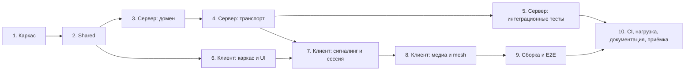

# Implementation Plan — Видеочат-комната (Video Chat Room)

| | |
|---|---|
| **Документ** | Implementation Plan (IP) |
| **Версия** | 1.0 |
| **feature-name** | `video-chat-room` |
| **PRD** | [`prd-video-chat-room.md`](../../prd-video-chat-room.md) (v1.0) |
| **TDD** | [`design-video-chat-room.md`](./design-video-chat-room.md) (v1.0) |
| **Шаблон** | `prd-tasks.mdc` |
| **Оценка** | ≈ 30 человеко-дней (1 разработчик); ≈ 20 дней при двух потоках после M0 |

## Как читать план

- **FR-n** — пункт n раздела 4 PRD (функциональные требования), **US-n** — user story PRD. **Design: x.y** — раздел TDD.
- Каждая подзадача рассчитана на 0.25–1 день и на **один PR**. PR считается готовым, когда проходят `npm run lint` и тесты, написанные в этой же задаче: тесты идут в одном PR с кодом, а не отдельной задачей в конце.
- **Зависит от** — задачи, которые должны быть смержены до начала. Если зависимость не указана, задача опирается только на предыдущие подзадачи своего эпика.
- Стек по PRD §7: **JavaScript (ES6+, ESM)**, Node.js, React, Socket.io, WebRTC. TypeScript не используется (TDD §1.2). Формы данных описаны JSDoc-комментариями `@typedef`, как в TDD §4–6.

## Вехи

| Веха | Содержание | После задач | Что можно показать |
|---|---|---|---|
| **M0** | Монорепозиторий, общие константы, контракты событий и валидация | 1, 2 | `npm run lint && npm test` зелёные |
| **M1** | Сервер + UI комнаты **без медиа**: вход, лимит 4, чат, список участников, выход | 3, 4, 5, 6, 7 | Две вкладки переписываются, пятая видит «Комната заполнена» |
| **M2** | Полноценный звонок: WebRTC mesh, тумблеры, ошибки устройств, autoplay | 8 | Звонок на 4 вкладки / устройства |
| **M3** | E2E, CI, README, ручная приёмка | 9, 10 | Готово к сдаче |

## Зависимости между эпиками

После M0 работа идёт в два параллельных потока: **сервер** (эпики 3 → 4 → 5) и **клиентский UI** (эпик 6). Потоки сходятся в эпике 7.

---

## Задачи

- [x] 1. Каркас монорепозитория на JavaScript
  - npm workspaces, ESM, линт, тестовый раннер и подключение `@vcr/shared` к серверу и клиенту.
  - _Requirements: PRD §7 (стек), Design: 1.2, 3.3, 3.4, 12.1_

  - [x] 1.1 Инициализировать npm workspaces — **0.5 д**
    - Корневой `package.json` с workspaces `shared`, `server`, `client`; `engines.node >= 20`; `.nvmrc`.
    - `"type": "module"` во всех пакетах (ESM в Node и в Vite).
    - `.gitignore`: `node_modules`, `dist`, `certs`, `coverage`, `playwright-report`, `test-results`.
    - DoD: `npm install` из корня ставит зависимости всех пакетов; `node server/src/index.js` с заглушкой запускается.
    - _Requirements: PRD §7, Design: 3.3, 3.4_

  - [x] 1.2 Настроить ESLint, Prettier и скрипты проверки — **0.5 д**
    - ESLint flat config: `@eslint/js` recommended, `eslint-plugin-react`, `eslint-plugin-react-hooks`, `globals` (node / browser по пакетам).
    - Правила безопасности: `react/no-danger`, `no-restricted-properties` для `innerHTML`/`outerHTML`.
    - Корневые скрипты: `lint`, `format`, `format:check`.
    - DoD: специально добавленный `dangerouslySetInnerHTML` в тестовом файле даёт ошибку линта (файл потом удалить).
    - _Requirements: FR-39, Design: 3.4, 10.3_

  - [x] 1.3 Настроить Vitest workspace и пороги покрытия — **0.5 д**
    - Корневой `vitest.config.js` с `test.projects`: `shared` (node), `server` (node), `client` (jsdom + `@testing-library/jest-dom`).
    - `@vitest/coverage-v8` с порогами из §11.7 для каждого пакета; скрипты `test`, `test:watch`, `test:coverage`.
    - По одному smoke-тесту на пакет.
    - _Requirements: —, Design: 11.1, 11.7_

  - [x] 1.4 Подключить `@vcr/shared` к серверу и клиенту — **0.25 д**
    - `shared/package.json`: `"type": "module"`, `"exports": "./src/index.js"` (сборка не нужна — это обычные ES-модули).
    - Workspace-зависимость `@vcr/shared` в `server` и `client`; смоук-импорт заглушки (`export const MAX_PARTICIPANTS = 4`) из Node, из Vite (dev и `vite build`) и из Vitest.
    - Зависит от: 1.1.
    - _Requirements: —, Design: 3.3_

- [x] 2. Пакет `@vcr/shared`: константы, контракты событий, валидация
  - Единый источник продуктовых констант, имён событий, описаний DTO и правил валидации для клиента и сервера.
  - _Requirements: FR-1, FR-7, FR-24, FR-30, FR-38, FR-39, FR-40, Design: 4.3, 5.2, 6.2, 6.3, 8.1_

  - [x] 2.1 Константы и коды ошибок — **0.25 д**
    - `constants.js`: `MAX_PARTICIPANTS`, `NAME_MAX_LENGTH`, `MESSAGE_MAX_LENGTH`, `CHAT_HISTORY_LIMIT`, `ROOM_ID_PATTERN`, `NAME_ALLOWED_CHARS`, `NAME_HAS_ALNUM`.
    - `errors.js`: `ERROR_CODES` (12 кодов из §8.1, `Object.freeze`) и `ERROR_MESSAGES` с русскими текстами для каждого кода; тест, что у каждого кода есть текст.
    - Зависит от: 1.4.
    - _Requirements: FR-7, FR-8, FR-38, FR-40, Design: 4.3, 8.1_

  - [x] 2.2 Словарь событий и JSDoc-описания DTO — **0.25 д**
    - `events.js`: константы имён событий `CLIENT_EVENTS` (`room:join`, `room:leave`, `chat:send`, `media:state`, `signal`) и `SERVER_EVENTS` (`participant:joined` / `left` / `media`, `chat:message`, `signal`, `signal:error`).
    - JSDoc `@typedef` для `ParticipantDTO`, `ChatMessage`, `SignalData` и формата ack из §5.2, §6.2, §6.3 — справка для IDE и ревью; barrel-экспорт в `index.js`.
    - Unit-тест: имена событий уникальны и совпадают с таблицами §6.3–6.4.
    - Зависит от: 2.1.
    - _Requirements: FR-10, FR-21, FR-22, FR-26, FR-30, Design: 5.2, 6.2, 6.3_

  - [x] 2.3 Валидация и нормализация имени — **0.5 д**
    - `normalizeName` (trim, схлопывание пробелов, NFC), `validateName(raw)` (принимает значение любого типа) → `NAME_EMPTY` / `NAME_TOO_LONG` / `NAME_INVALID_CHARS`; длина считается в code points.
    - Unit-тесты граничных случаев: пустое и пробельное имя; ровно 30 и 31 символ; кириллица, `ё`, латиница, цифры, `-_.`; `"..."`; эмодзи; `<script>`; кавычки; `/`; zero-width space; комбинируемые диакритики.
    - Зависит от: 2.1.
    - _Requirements: FR-1, FR-38, US-1, Design: 4.3, 11.2_

  - [x] 2.4 Валидация сообщения и идентификатора комнаты — **0.5 д**
    - `normalizeMessage` (trim, удаление `\p{Cc}` кроме `\n`, удаление bidi-override `U+202A–202E`, `U+2066–2069`), `validateMessage` → `MESSAGE_EMPTY` / `MESSAGE_TOO_LONG`; `isValidRoomId(id)` → `boolean` (не-строка → `false`).
    - Unit-тесты: пробелы и переводы строк, 1000/1001 символ, управляющие и bidi-символы, границы `roomId` 0/1/64/65 символов, кириллица и `nanoid(10)` проходят, недопустимые символы (`a/b`, `<b>`, пробел, `%`) не проходят.
    - Зависит от: 2.1.
    - _Requirements: FR-24, FR-39, FR-40, US-8, Design: 4.3, 10.3, 11.2_

- [x] 3. Сервер: доменная логика комнат (без сети)
  - Чистые классы без Socket.io: комнаты, атомарный лимит, история, rate limit, разбор payload. Покрываются unit-тестами на 90%.
  - _Requirements: FR-5, FR-7, FR-9, FR-23, FR-25, FR-30, FR-32, FR-40, Design: 4.2.1, 4.2.2, 4.2.3, 5.2, 5.3, 10.4_

  - [x] 3.1 Класс `Room`: участники и история — **0.5 д**
    - `participants: Map` (порядок вставки), `add`/`remove`/`has`/`size`.
    - Кольцевой буфер истории на `CHAT_HISTORY_LIMIT`; `pushMessage`; `snapshot(excludePid)` → `{ participants: ParticipantDTO[], messages: ChatMessage[] }`.
    - Unit-тесты: порядок участников, вытеснение 201-го сообщения, `snapshot` без исключённого участника.
    - Зависит от: 2.2.
    - _Requirements: FR-9, FR-23, FR-26, Design: 4.2.1, 5.2_

  - [x] 3.2 `RoomManager.join` / `leave`: атомарный лимит и жизненный цикл — **1 д**
    - `join()` **синхронный** (возвращает `JoinOutcome`, не `Promise`): создание комнаты при отсутствии, проверка `size >= MAX_PARTICIPANTS` → `ROOM_FULL`, `participantId = crypto.randomUUID()`, индекс `byParticipant`.
    - `leave(participantId)` идемпотентный → `{ room, participant, roomDeleted } | null`; удаление пустой комнаты вместе с историей.
    - Комментарий-инвариант «без await между проверкой и вставкой» + override ESLint для `rooms/**`: `no-restricted-syntax` запрещает `AwaitExpression` и async-функции.
    - Unit-тесты: первый вход создаёт комнату; 4 входа ok, 5-й `ROOM_FULL`; после выхода одного — снова ok; выход последнего удаляет комнату; повторный вход по тому же id → пустая история; двойной `leave`; одинаковые имена → разные id; у всех участников одинаковые права (флагов «создатель» нет).
    - Зависит от: 3.1.
    - _Requirements: FR-5, FR-7, FR-9, FR-30, FR-32, US-5, US-10, Design: 4.2.2, 4.2.3_

  - [x] 3.3 `RoomManager`: сообщения, состояние медиа, статистика — **0.5 д**
    - `addChatMessage(participantId, text)` → `ChatMessage` с `type: 'user'` (`ts` сервера, `authorName` снимком); `addSystemMessage(roomId, event, subjectName)`.
    - `setMediaState(participantId, state)`; `getRoomOf(participantId)`; `stats()`; `toDTO(participant)` без `socketId`.
    - Unit-тесты: сообщения попадают в историю комнаты автора; системные сообщения сохраняются; `toDTO` не содержит `socketId`.
    - Зависит от: 3.2.
    - _Requirements: FR-15, FR-21, FR-22, FR-25, Design: 5.2, 5.3_

  - [x] 3.4 `RateLimiter` (token bucket) — **0.5 д**
    - `consume(key, bucket): boolean`; конфигурация бакетов `join` 5/10 с, `chat` 5/5 с, `media` 20/10 с, `signal` 300/10 с; очистка ключей при отключении сокета (`forget(socketId)`).
    - Unit-тесты на fake timers: burst, пополнение, изоляция ключей и бакетов, `forget`.
    - Зависит от: 1.3.
    - _Requirements: FR-40, Design: 10.4_

  - [x] 3.5 Проверка формы входящих payload — **0.5 д**
    - `validate(schemaName, payload)` → `{ ok: true, value } | { ok: false, code: 'INVALID_PAYLOAD' }` для схем `join`, `chat`, `media`, `signal`, без внешних зависимостей; отбрасывание лишних полей, проверка `SignalData` трёх видов, ограничение длины `sdp` и `candidate`.
    - Unit-тесты: не-объект, `null`, неверные типы, лишние поля, `candidate: null`, неизвестный `type`.
    - Зависит от: 2.2, 2.4.
    - _Requirements: FR-10, FR-38, Design: 4.2.1, 6.2, 8.1_

- [x] 4. Сервер: HTTP, Socket.io и обработчики событий
  - Сетевой слой поверх доменной логики: Express, Socket.io, обработчики `room`/`chat`/`media`/`signal`.
  - _Requirements: FR-1, FR-4…FR-10, FR-15, FR-16, FR-21…FR-31, FR-35, FR-40, Design: 4.2, 6.1–6.5, 7.1–7.6, 10, 12.3, 12.5_

  - [x] 4.1 Конфигурация и логгер — **0.5 д**
    - `config.js`: чтение и валидация env (`PORT`, `HOST`, `SSL_CERT_PATH`, `SSL_KEY_PATH`, `STUN_URLS` → массив `{ urls }`, `CHAT_HISTORY_LIMIT`, `LOG_LEVEL`, `CLIENT_DIST_DIR`), замороженный объект конфигурации, понятная ошибка при неверных значениях.
    - `logger.js`: pino; `redact` для `text`, `sdp`, `candidate`; имя — только на уровне `debug`.
    - Unit-тесты `config` (дефолты, парсинг `STUN_URLS`, ошибка при одном из двух SSL-путей).
    - Зависит от: 1.3.
    - _Requirements: FR-34, Design: 10.5, 12.3_

  - [x] 4.2 Express-приложение: безопасность, статика, `/healthz` — **0.5 д**
    - `createApp(config, deps)`: `helmet` с CSP из §10.3, `Permissions-Policy`, `Referrer-Policy: no-referrer`, `express.static` с `immutable` для `/assets`, `GET /healthz` (`status`, `rooms`, `participants`, `uptimeSec`, `version`), SPA fallback.
    - Тесты на `supertest`: заголовки CSP и Permissions-Policy, `/healthz`, fallback на `/room/abc123`.
    - Зависит от: 4.1.
    - _Requirements: FR-39, Design: 6.1, 10.2, 10.3_

  - [x] 4.3 Bootstrap сервера и Socket.io — **0.5 д**
    - `index.js`: HTTP или HTTPS в зависимости от сертификатов; `new Server(httpServer, …)` с `pingInterval 5000`, `pingTimeout 10000`, `maxHttpBufferSize 64 KB`, без `connectionStateRecovery`.
    - Экспорт `createServer(config)` → `{ httpServer, io, roomManager, close() }` (нужен интеграционным тестам); graceful shutdown по `SIGINT`/`SIGTERM` с таймаутом 5 с.
    - Скрипт `server:dev` = `node --watch src/index.js`.
    - Зависит от: 3.2, 4.2.
    - _Requirements: FR-31, FR-35, Design: 4.2.1, 6.2, 12.1, 12.5_

  - [x] 4.4 Обработчики `room:join`, `room:leave`, `disconnect` — **1 д**
    - `registerHandlers(io, deps)`: `socket.data = { participantId: null, roomId: null }`, обёртка обработчиков try/catch → `INTERNAL_ERROR`.
    - `room:join`: guard → rate limit → `isValidRoomId` / `validateName` → `ALREADY_IN_ROOM` → `RoomManager.join` → синхронный `socket.join` → broadcast `participant:joined` + системное `joined` → ack `{ ok: true, self, participants, messages, iceServers, limits }` (снимок без себя).
    - `room:leave` и `disconnect` → общий `handleLeave`: `participant:left` + системное `left` (не «соединение потеряно»), `rateLimiter.forget`.
    - Доступ по угаданному `roomId` не ограничивается — никаких проверок «владельца».
    - Зависит от: 3.3, 3.4, 3.5, 4.3.
    - _Requirements: FR-1, FR-4…FR-9, FR-25, FR-27, FR-28, FR-29, FR-31, FR-32, US-4, US-5, US-10, US-11, Design: 4.2.2, 6.3, 6.4, 7.1, 7.3, 7.6, 8.1_

  - [x] 4.5 Обработчики `chat:send` и `media:state` — **0.5 д**
    - `chat:send`: только в комнате → rate limit `chat` → `validateMessage` → `addChatMessage` → ack `{ ok: true, message }` + broadcast `chat:message` всей комнате.
    - `media:state`: guard → rate limit `media` (молча) → `setMediaState` → `participant:media` комнате, кроме отправителя.
    - Зависит от: 4.4.
    - _Requirements: FR-15, FR-16, FR-18, FR-21, FR-22, FR-24, FR-40, US-7, US-8, Design: 6.3, 6.4, 7.4, 7.5_

  - [x] 4.6 Обработчик `signal` (relay) — **0.5 д**
    - Guard → rate limit `signal` → получатель `to` должен быть в **той же** комнате → `io.to(target.socketId).emit('signal', { from: socket.data.participantId, data })`; иначе `signal:error` (`PEER_NOT_FOUND`, `INVALID_SIGNAL`, `RATE_LIMITED`).
    - Поле `from` из payload игнорируется, его проставляет сервер.
    - Зависит от: 4.4.
    - _Requirements: FR-10, Design: 3.2, 6.3, 6.5, 10.1_

- [ ] 5. Сервер: интеграционные тесты на реальных сокетах
  - Сценарии I-1…I-11 из TDD против настоящего сервера на эфемерном порту и `socket.io-client`.
  - _Requirements: FR-4…FR-10, FR-15, FR-16, FR-21, FR-23…FR-25, FR-27, FR-29, FR-31, FR-38, FR-40, Design: 11.3_

  - [ ] 5.1 Тестовый стенд — **0.5 д**
    - `server/test/integration/harness.js`: `startTestServer()` на порту `0`, `connectClient()` → клиентский сокет, `joinAs(client, roomId, name)`, `waitForEvent(client, event, predicate, timeoutMs)`, автоматическое закрытие в `afterEach`.
    - Отдельный Vitest-проект `server-integration` и скрипт `test:integration`.
    - Зависит от: 4.3.
    - _Requirements: —, Design: 11.1, 11.3_

  - [ ] 5.2 Вход, лимит, гонка — **0.5 д**
    - I-1 (два участника: ack и события), I-2 (5-й `ROOM_FULL`, остальные ничего не получают), I-3 (3 участника + два одновременных `join`, 50 итераций: ровно один ok), I-11 (двойной `join` с одного сокета).
    - Зависит от: 4.4, 5.1.
    - _Requirements: FR-4, FR-7, FR-8, FR-29, US-5, Design: 7.3, 11.3_

  - [ ] 5.3 Чат, история, выход, удаление комнаты — **0.5 д**
    - I-4 (broadcast и история для вошедшего позже), I-6 (`room:leave` и `disconnect` → `participant:left` + системное сообщение без дублей), I-7 (все вышли → `stats().rooms === 0`, повторный вход → пустая история).
    - Зависит от: 4.5, 5.1.
    - _Requirements: FR-9, FR-21, FR-23, FR-25, FR-27, FR-31, Design: 5.3, 7.5, 7.6, 11.3_

  - [ ] 5.4 Валидация, relay, rate limit, состояние медиа — **0.5 д**
    - I-5 (невалидные имена, `roomId`, `chat:send` без входа, payload не объект), I-8 (relay только в своей комнате, `from` не подделать), I-9 (6-е сообщение → `RATE_LIMITED`), I-10 (`participant:media` и актуальное состояние в ack для вошедшего позже).
    - Зависит от: 4.5, 4.6, 5.1.
    - _Requirements: FR-10, FR-15, FR-16, FR-38, FR-40, Design: 8.1, 10.1, 10.4, 11.3_

- [ ] 6. Клиент: каркас приложения и UI-компоненты
  - Vite + React, роутинг, reducer и «глупые» компоненты: работают на моках, от сети и WebRTC не зависят.
  - _Requirements: FR-1…FR-3, FR-8, FR-11, FR-12, FR-16, FR-18, FR-21…FR-28, FR-35…FR-39, PRD §6, Design: 4.1.1, 4.1.5, 4.1.6, 5.4, 7.5, 8.2_

  - [ ] 6.1 Каркас клиента: Vite, роутинг, раскладка — **0.5 д**
    - `vite.config.js`: `@vitejs/plugin-react`, HTTPS из `certs/` (если есть), `server.host: true`, proxy `/socket.io` → `:3000` c `ws: true` (сервер в dev слушает порт по умолчанию, env-префиксы в скриптах не нужны — одинаково в Windows и Unix).
    - `App.jsx`: маршруты `/`, `/room/:roomId`, `*` → `/`; пустые `HomePage` и `RoomPage`.
    - `RoomLayout`: область сетки + правая панель 320px, `min-width: 1024px`; базовые CSS-переменные.
    - Корневой скрипт `dev` = `concurrently` (`server:dev` + `client:dev`).
    - Зависит от: 1.4.
    - _Requirements: FR-11, PRD §6, Design: 3.3, 4.1.1, 4.1.5, 12.1_

  - [ ] 6.2 `sessionName` и утилиты — **0.5 д**
    - `state/sessionName.js`: переменная модуля `get`/`set`/`clear`, **без** storage и `history.state`.
    - `utils/formatTime.js` (`HH:MM`, `Intl.DateTimeFormat('ru-RU')`), `utils/gridLayout.js` (1–4 → колонки и ряды), `utils/clipboard.js` (`navigator.clipboard` + fallback через выделенный `input`), `utils/mediaErrors.js` (`DOMException.name` → статус трека `ok` / `DENIED` / `NOT_FOUND` / `BUSY` / `ERROR`; константы клиентских кодов из §8.2).
    - Unit-тесты для каждой утилиты (TZ фиксируется через env в конфиге Vitest).
    - Зависит от: 6.1.
    - _Requirements: FR-3, FR-22, FR-28, Design: 4.1.4, 4.1.5, 5.4, 8.2_

  - [ ] 6.3 `roomReducer` и контекст комнаты — **0.5 д**
    - `initialState` и список действий из §4.1.6 как константы `ACTIONS` (без строковых литералов в компонентах); неизвестное действие в `default` выбрасывает ошибку.
    - Дедупликация `CHAT_MESSAGE` по `id`, ограничение истории `CHAT_HISTORY_LIMIT`, `PARTICIPANT_LEFT` удаляет и участника, и `links[peerId]`.
    - `RoomContext` (state + dispatch + доступ к `RoomSession`).
    - Unit-тесты на все действия.
    - Зависит от: 2.2, 6.1.
    - _Requirements: FR-23, FR-26, FR-30, Design: 4.1.6_

  - [ ] 6.4 `NameForm` и `HomePage` — **0.5 д**
    - `NameForm`: `maxLength=30`, `validateName` из `shared`, подсказка под полем, блокировка кнопки при `busy`, отправка по Enter.
    - `HomePage`: «Создать комнату» → `nanoid(10)` → `sessionName.set` → `navigate('/room/:id')`.
    - Компонентные тесты: пустое и пробельное имя → подсказка, переход не происходит; недопустимые символы → подсказка; валидное имя → вызван `navigate` с корректным id.
    - Зависит от: 2.3, 6.2.
    - _Requirements: FR-1, FR-2, FR-38, US-1, US-2, Design: 4.1.1, 4.1.5, 7.1_

  - [ ] 6.5 `StatusScreen` и `Toasts` — **0.5 д**
    - `StatusScreen` для `roomFull` («Комната заполнена» + «Повторить вход»), `serverUnavailable` («Сервер недоступен» + «Повторить»), `unsupported`, `insecureContext`, `connectionLost` («Войти заново»), `joinError`/`INVALID_ROOM_ID` («На главную»).
    - `Toasts`: очередь, автоскрытие, `role="status"`.
    - Компонентные тесты: текст и действие для каждого состояния.
    - Зависит от: 2.1, 6.1.
    - _Requirements: FR-8, FR-33, FR-35, FR-36, US-5, US-12, US-13, Design: 4.1.5, 8.1, 8.2_

  - [ ] 6.6 `ChatPanel`: лента, ввод, автопрокрутка — **1 д**
    - `MessageList`: пользовательские и системные сообщения («Имя присоединился(-ась)» / «покинул(а) комнату»), автор и `HH:MM`, рендер **только** текстовыми узлами, `white-space: pre-wrap`.
    - `MessageInput`: запрет пустой отправки, `maxLength` из `limits`, счётчик, Enter — отправить, Shift+Enter — перенос; текст сохраняется при ошибке ack.
    - `useAutoScroll`: прокрутка к последнему сообщению при каждом новом сообщении — своём, чужом, системном (US-8, FR-23).
    - Компонентные тесты: `` отображается текстом и в DOM нет `img`; пустое сообщение не отправляется; новое сообщение прокручивает ленту вниз, даже если перед этим она была прокручена вверх.
    - Зависит от: 6.2, 6.3.
    - _Requirements: FR-21, FR-22, FR-23, FR-24, FR-25, FR-39, US-8, US-9, Design: 4.1.5, 7.5, 10.3, 14 (Q-6)_

  - [ ] 6.7 `ParticipantList` и `ControlsBar` — **0.5 д**
    - `ParticipantList`: имена в порядке входа, «(Вы)» у себя, иконки выключенного микрофона и камеры; ключи по `id`.
    - `ControlsBar`: микрофон и камера (`aria-pressed`, недоступны при `NOT_FOUND` с подсказкой), «Скопировать ссылку» (`clipboard` + toast), «Выйти».
    - Компонентные тесты: одинаковые имена отображаются оба; нажатия вызывают колбэки; toast после копирования.
    - Зависит от: 6.2, 6.5.
    - _Requirements: FR-3, FR-15, FR-17, FR-26, FR-27, FR-30, US-3, US-7, US-9, Design: 4.1.5_

  - [ ] 6.8 `VideoTile`, `VideoGrid`, `useMediaElement` — **1 д**
    - `useMediaElement(stream)`: привязка `srcObject`, вызов `play()`, отчёт о `NotAllowedError` (для autoplay, задача 8.6), очистка при размонтировании.
    - `VideoTile`: `<video autoPlay playsInline>`, оверлей имени, иконка перечёркнутого микрофона, силуэт + имя при `video=false`, бейдж «Нет медиасоединения» при `linkStatus='failed'`; self — `muted`, зеркально, подпись «Вы», своя рамка.
    - `VideoGrid`: раскладка по `gridLayout`, self первой; плитки 16:9, `object-fit: cover`.
    - Компонентные тесты: все визуальные состояния плитки; порядок плиток; раскладки 1–4.
    - Зависит от: 6.2, 6.3.
    - _Requirements: FR-8, FR-11, FR-12, FR-16, FR-18, US-6, US-12, Design: 4.1.5, 14 (Q-1)_

- [ ] 7. Клиент: сигналинг, сессия и экран комнаты (без WebRTC)
  - Подключение к серверу, конечный автомат входа, чат и список участников end-to-end. **Итог — веха M1.**
  - _Requirements: FR-4…FR-9, FR-21, FR-25…FR-28, FR-31, FR-35, FR-36, Design: 4.1.2, 4.1.3, 6.2–6.4, 7.1, 7.6, 8.2_

  - [ ] 7.1 `environment` и `SignalingClient` — **1 д**
    - `environment.js`: `checkSupport()` проверяет **сначала** `isSecureContext` → `INSECURE_CONTEXT`, **затем** `RTCPeerConnection` и `mediaDevices.getUserMedia` → `WEBRTC_UNSUPPORTED` (в незащищённом контексте `mediaDevices` нет даже в поддерживаемом браузере, §4.1.2). Unit-тест на порядок.
    - `SignalingClient` поверх `socket.io-client` (имена событий из `@vcr/shared/events.js`): `io({ reconnection: false, timeout: 5000, autoConnect: false })`; `connect()` с таймаутом → `SERVER_UNAVAILABLE`; `join`/`leave`/`sendChat` через `emitWithAck` с таймаутом; `sendMediaState`, `sendSignal`; `on()` возвращает функцию отписки; событие `disconnected(reason)` с признаком «по инициативе клиента».
    - Unit-тесты на мок-сокете: таймаут подключения, ошибка ack, отписка, различение причин disconnect.
    - Зависит от: 2.2, 6.1.
    - _Requirements: FR-31, FR-35, FR-36, US-13, Design: 4.1.3, 6.2, 8.2_

  - [ ] 7.2 `RoomSession`, часть 1: вход, события, чат, выход — **1 д**
    - `start({ roomId, name })`: `checkSupport` → `connect` → `join` → `JOIN_OK` / `JOIN_FAILED`.
    - Подписки: `participant:joined` / `left` / `media`, `chat:message` → действия reducer.
    - `sendMessage(text)` (ошибки ack → toast), `leave()` (ack → `disconnect` → `LEFT`), обработка неожиданного `disconnect` → `CONNECTION_LOST`, `destroy()` снимает все подписки.
    - Unit-тесты с моком `SignalingClient`: успешный вход, `ROOM_FULL`, `SERVER_UNAVAILABLE`, потеря соединения, выход.
    - Зависит от: 6.3, 7.1.
    - _Requirements: FR-4, FR-5, FR-8, FR-9, FR-21, FR-25, FR-26, FR-27, FR-31, US-4, US-9, US-10, US-11, Design: 4.1.3, 6.3, 6.4, 7.6_

  - [ ] 7.3 `RoomPage` и `useRoomSession`: конечный автомат входа — **1 д**
    - Фазы из §4.1.2: `NameForm` пропускается, если имя есть в `sessionName`; проверка `isValidRoomId` до подключения; `INVALID_NAME` в ack → обратно на `NameForm` с подсказкой; защита от двойного клика; «Повторить вход» для `roomFull` и `serverUnavailable`; «Войти заново» для `connectionLost`; «Выйти» → `navigate('/')`.
    - Сборка экрана: `VideoGrid` (пока только плитки-заглушки), `ControlsBar`, `ParticipantList`, `ChatPanel`, `Toasts`.
    - `pagehide` → best-effort `room:leave`; очистка сессии при размонтировании.
    - Компонентные тесты `RoomPage` с моком `RoomSession`: переходы между фазами; после перезагрузки (очищенный `sessionName`) показывается форма имени.
    - Ручная проверка вехи **M1**: две вкладки переписываются и видят друг друга в списке; пятая получает «Комната заполнена»; закрытие вкладки → системное сообщение.
    - Зависит от: 4.6, 6.4, 6.5, 6.6, 6.7, 6.8, 7.2.
    - _Requirements: FR-4, FR-5, FR-8, FR-28, FR-29, FR-35, US-4, US-5, US-10, US-13, Design: 4.1.1, 4.1.2, 7.1, 8.3_

- [ ] 8. Клиент: медиа и WebRTC mesh
  - Локальные устройства, P2P-соединения со всеми участниками, тумблеры без повторного согласования, ошибки устройств и autoplay. **Итог — веха M2.**
  - _Requirements: FR-10, FR-13…FR-20, FR-33, FR-34, FR-37, Design: 3.2, 4.1.3, 4.1.4, 7.2, 7.4, 8.2, 8.3_

  - [ ] 8.1 `MediaManager.acquire()`: первичный захват с частичным успехом — **1 д**
    - `enumerateDevices` → наличие устройств; один запрос `getUserMedia` на оба вида; при ошибке — отдельные запросы на каждый вид.
    - Результат `{ audio: TrackResult, video: TrackResult }`, соответствие ошибок через `mediaErrors`; `VIDEO_CONSTRAINTS` (640×480, 24 fps). Если устройств нет совсем, `getUserMedia` не вызывается.
    - Unit-тесты на моке `navigator.mediaDevices`: всё ok; нет камеры; отказ в доступе; камера занята (`NotReadableError`), а микрофон ok; нет устройств вообще (`getUserMedia` не вызван, оба `NOT_FOUND`).
    - Зависит от: 6.2.
    - _Requirements: FR-13, FR-14, FR-33, US-6, US-12, Design: 4.1.4, 8.2_

  - [ ] 8.2 `MediaManager`: тумблеры, потеря устройства, освобождение — **1 д**
    - `setAudioEnabled`: `track.enabled`, а если трека нет — захват микрофона.
    - `setVideoEnabled(false)`: `track.stop()` (аппаратный индикатор гаснет); `setVideoEnabled(true)`: новый `getUserMedia({ video })`, ошибка → статус трека (`DENIED` / `NOT_FOUND` / `BUSY` / `ERROR`).
    - `onended` трека → `onDeviceLost(kind)`; `onTrackChange(kind, track | null)` для mesh; `dispose()` останавливает все треки.
    - Unit-тесты: `stop` вызывается при выключении камеры; повторное включение создаёт новый трек; ошибка включения не меняет состояние; `ended` → колбэк; `dispose`.
    - Зависит от: 8.1.
    - _Requirements: FR-15, FR-17, FR-19, FR-20, US-7, Design: 4.1.4, 7.4_

  - [ ] 8.3 `PeerLink`: одно P2P-соединение — **1 д**
    - `createOfferer` / `createAnswerer`: трансиверы `audio` + `video` `sendrecv`, `replaceTrack(localTrack ?? null)`, единственный обмен SDP через внедрённый `sendSignal`; `onnegotiationneeded` не используется.
    - Очередь ICE-кандидатов до `setRemoteDescription`; `candidate: null` → end-of-candidates.
    - `remoteStream` из `pc.getReceivers()`; `replaceTrack(kind, track)`; статус `connecting` → `connected` / `failed` (таймаут 15 с или `connectionState='failed'`); `close()`.
    - `iceServers` берутся из ack `room:join`.
    - Unit-тесты на моке `RTCPeerConnection`: порядок вызовов у offerer и answerer; answerer ставит `sendrecv`; кандидаты из очереди применяются после описания; таймаут → `failed`; `close` идемпотентен.
    - Зависит от: 2.2.
    - _Requirements: FR-10, FR-34, US-6, Design: 3.2, 4.1.4, 7.2_

  - [ ] 8.4 `PeerMesh`: реестр соединений — **0.5 д**
    - `connectTo(peerIds)` — создать offerer для каждого участника из снимка; `handleSignal(from, data)` — answerer на offer от неизвестного пира, маршрутизация answer и candidate, игнор сигналов от ушедших; защитное пересоздание при повторном offer.
    - `removePeer`, `broadcastTrack(kind, track)`, `closeAll()`, `getStream(peerId)`, события статуса.
    - Unit-тесты с фабрикой-моком `PeerLink`: роли offerer/answerer; сигнал от неизвестного `from` после выхода игнорируется; `broadcastTrack` доходит до всех.
    - Зависит от: 8.3.
    - _Requirements: FR-10, US-6, US-11, Design: 3.2, 4.1.3, 7.2, 8.3_

  - [ ] 8.5 `RoomSession`, часть 2: подключение медиа и mesh — **1 д**
    - После `JOIN_OK` **параллельно**: `mesh.connectTo(participants)` сразу с `null`-треками и `acquire()` → `LOCAL_MEDIA` → `broadcastTrack` → `media:state`. Offer не ждёт диалога разрешений (Design 4.1.2, 7.2). Входящий `signal` → `mesh.handleSignal`; `participant:left` → `removePeer`; `signal:error PEER_NOT_FOUND` → `removePeer`.
    - `toggleMic` / `toggleCamera` → `MediaManager` → `broadcastTrack` → `media:state`; потеря устройства → toast «Устройство отключено» + `media:state`; toasts для `DENIED` / `BUSY` / `NOT_FOUND`.
    - `LINK_STATUS` в reducer; `getStream(peerId)` для плиток; при `leave` / `CONNECTION_LOST` / `destroy` — `closeAll()` и `dispose()`.
    - Unit-тесты с моками Media/Mesh/Signaling: `connectTo` вызывается до завершения `acquire()` (промис захвата не разрешён); отказ в доступе не выбрасывает из комнаты; выключение камеры рассылает `null`-трек и `media:state`; очистка ресурсов.
    - Ручная проверка вехи **M2**: 2–4 вкладки видят и слышат друг друга; тумблеры и индикаторы; индикатор камеры гаснет.
    - Зависит от: 7.3, 8.2, 8.4.
    - _Requirements: FR-10, FR-13…FR-20, FR-33, US-6, US-7, US-11, US-12, Design: 4.1.3, 4.1.4, 7.2, 7.4, 8.2, 8.3, 13 (R-8)_

  - [ ] 8.6 Autoplay: баннер «Включить звук» — **0.5 д**
    - `useMediaElement` сообщает об отклонённом `play()` → `AUDIO_LOCKED`; `AudioUnlockBanner` по клику вызывает `play()` у всех удалённых элементов и сбрасывает флаг.
    - Компонентные тесты: баннер появляется при `NotAllowedError` и исчезает после клика.
    - Зависит от: 6.8, 8.5.
    - _Requirements: FR-37, US-13, Design: 4.1.1, 4.1.5, 8.2_

  - [ ] 8.7 Тестовый хук `window.__vcr` — **0.25 д**
    - Только при `import.meta.env.MODE === 'test'`: `links` (статусы по пирам), состояние локальных треков (`readyState`, `enabled`), `participants`.
    - Проверка сборки: в production-бандле хука нет (поиск строки `__vcr` в `client/dist`).
    - Зависит от: 8.5.
    - _Requirements: —, Design: 11.4, 13 (R-9)_

- [ ] 9. Prod-like сборка и E2E-тесты
  - Сборка одним процессом и автоматические браузерные сценарии E-1…E-10 в Chromium с fake media.
  - _Requirements: US-1…US-13 (сквозные сценарии), Design: 11.4, 12.1, 12.2_

  - [ ] 9.1 Prod-like сборка и запуск — **0.5 д**
    - `build` = `vite build` (`client/dist`); `start` = `node server/src/index.js` (серверу сборка не нужна); сервер отдаёт `client/dist`.
    - HTTPS при заданных `SSL_CERT_PATH` / `SSL_KEY_PATH`; проверка на `https://<LAN-IP>:3000` с сертификатом mkcert.
    - DoD: после `npm run build && npm start` звонок работает из двух браузеров на разных машинах в LAN.
    - Зависит от: 4.3, 8.5.
    - _Requirements: PRD §7 (HTTPS), Design: 12.1, 12.2, 12.3_

  - [ ] 9.2 Настройка Playwright — **0.5 д**
    - Папка `e2e/` (`@playwright/test` — devDependency в корне): `playwright.config.js` (Chromium, `--use-fake-ui-for-media-stream`, `--use-fake-device-for-media-stream`, `webServer`: `vite build --mode test` + `node server/src/index.js`, `retries: 1`, trace on failure). Скрипт `build:test`.
    - Хелперы: `createParticipant(browser, name)` (отдельный `browserContext`), `createRoom`, `joinRoom(url)`, `waitForPeerConnected(page, count)` через `window.__vcr`.
    - Зависит от: 8.7, 9.1.
    - _Requirements: —, Design: 11.4_

  - [ ] 9.3 E2E: создание, вход по ссылке, имя, перезагрузка — **0.5 д**
    - E-1 (создание, копирование ссылки, второй участник, плитки с именами, `videoWidth > 0`), E-2 (пустое имя), E-10 (перезагрузка → форма имени, у других — выход).
    - Зависит от: 9.2.
    - _Requirements: FR-1…FR-4, FR-11, FR-12, FR-28, US-1…US-4, US-6, US-10, Design: 11.4_

  - [ ] 9.4 E2E: лимит и выход — **0.5 д**
    - E-3 (4 участника + пятый → «Комната заполнена», после выхода одного «Повторить вход» успешен), E-6 («Выйти» и `page.close()` → плитка исчезает, системное сообщение).
    - Зависит от: 9.2.
    - _Requirements: FR-7, FR-8, FR-25, FR-27, FR-28, FR-31, US-5, US-9, US-10, US-11, Design: 11.4_

  - [ ] 9.5 E2E: тумблеры и чат — **0.5 д**
    - E-4 (иконка микрофона и силуэт у собеседника; `videoTrack.readyState === 'ended'` у выключившего), E-5 (HTML в сообщении отображается текстом, формат `HH:MM`, история у вошедшего позже).
    - Зависит от: 9.2.
    - _Requirements: FR-15…FR-19, FR-21…FR-23, FR-39, US-7, US-8, Design: 11.4_

  - [ ] 9.6 E2E: ошибки окружения — **0.5 д**
    - E-7 (`addInitScript`: `getUserMedia` → `NotAllowedError`; пользователь в комнате, toast), E-8 (нет `RTCPeerConnection` → «WebRTC не поддерживается»), E-9 (`page.routeWebSocket` закрывает WebSocket и `page.route` обрывает polling для `/socket.io` → «Сервер недоступен»; `page.route` сам WebSocket не перехватывает, нужен Playwright ≥ 1.48).
    - Зависит от: 9.2.
    - _Requirements: FR-33, FR-35, FR-36, US-12, US-13, Design: 8.2, 11.4_

- [ ] 10. CI, нагрузка, документация и приёмка
  - Автоматизация проверок, лёгкий нагрузочный прогон сигналинга, README для запуска в LAN, ручной чек-лист. **Итог — веха M3.**
  - _Requirements: US-6 (задержка), PRD §6 (1024px), PRD §7, Design: 9.1, 11.5, 11.6, 12.2–12.4, 13_

  - [ ] 10.1 CI на GitHub Actions — **0.5 д**
    - Workflow: `npm ci` → `lint` + `format:check` → `test:coverage` (пороги §11.7) → `test:integration` → `build` → `playwright install chromium` → `test:e2e`; артефакты: coverage, playwright-report, traces.
    - Кэш npm и браузеров Playwright.
    - Зависит от: 5.4, 9.6.
    - _Requirements: —, Design: 12.4_

  - [ ] 10.2 Нагрузочный скрипт сигналинга — **0.5 д**
    - `scripts/load-signaling.js` (запуск через `node`): 50 комнат × 4 сокета, по 20 сообщений и 30 фиктивных `signal` на участника; метрики — лишние `ROOM_FULL`, p95 доставки чата, RSS сервера из `/healthz` и `process.memoryUsage`.
    - Результаты записать в `docs/load-test.md`. Критерии: нет лишних `ROOM_FULL`, RSS < 150 МБ, p95 < 50 мс на localhost.
    - Зависит от: 4.6.
    - _Requirements: FR-7, Design: 9.1, 11.5_

  - [ ] 10.3 README — **0.5 д**
    - Требования (Node 20), установка, скрипты, структура монорепозитория.
    - HTTPS в LAN через mkcert: Windows / macOS / Linux, импорт корневого CA на других устройствах, запасной флаг Chrome (с пометкой «не для демо»).
    - Таблица env, ограничения (один процесс, нет TURN, данные в памяти), диагностика (`chrome://webrtc-internals`, изоляция клиентов Wi-Fi).
    - Зависит от: 9.1.
    - _Requirements: PRD §7, Design: 12.2, 12.3, 13 (R-1, R-3, R-4)_

  - [ ] 10.4 Ручная приёмка по чек-листу — **0.5 д**
    - Прогон §11.6: Chrome / Firefox / Edge; 4 устройства в LAN с замером задержки (≤ 500 мс); индикатор камеры гаснет; отключение USB-устройства; отказ в доступе в Firefox; autoplay в новой вкладке; ширина окна 1024px.
    - Результаты и найденные дефекты — в `docs/manual-test-report.md`; дефекты завести отдельными задачами.
    - Зависит от: 9.1.
    - _Requirements: FR-11, FR-19, FR-20, FR-33, FR-37, US-6, US-7, US-12, US-13, PRD §6, Design: 9.1, 11.6_

---

## Сводка оценок

| Эпик | Подзадач | Оценка, д | Веха |
|---|---|---|---|
| 1. Каркас монорепозитория на JavaScript | 4 | 1.75 | M0 |
| 2. Пакет `@vcr/shared` | 4 | 1.5 | M0 |
| 3. Сервер: доменная логика | 5 | 3.0 | M1 |
| 4. Сервер: HTTP, Socket.io, обработчики | 6 | 3.5 | M1 |
| 5. Сервер: интеграционные тесты | 4 | 2.0 | M1 |
| 6. Клиент: каркас и UI-компоненты | 8 | 5.0 | M1 |
| 7. Клиент: сигналинг, сессия, экран комнаты | 3 | 3.0 | M1 |
| 8. Клиент: медиа и WebRTC mesh | 7 | 5.25 | M2 |
| 9. Prod-like сборка и E2E | 6 | 3.0 | M3 |
| 10. CI, нагрузка, документация, приёмка | 4 | 2.0 | M3 |
| **Итого** | **51** | **30.0** | |

## Трассировка FR → задачи

| FR | Задачи | FR | Задачи |
|---|---|---|---|
| 1 | 2.3, 4.4, 6.4, 9.3 | 21 | 2.2, 3.3, 4.5, 5.3, 6.6, 7.2, 9.5 |
| 2 | 6.4, 9.3 | 22 | 2.2, 3.3, 4.5, 6.2, 6.6, 9.5 |
| 3 | 6.2, 6.7, 9.3 | 23 | 3.1, 5.3, 6.3, 6.6, 9.5 |
| 4 | 4.4, 5.2, 7.2, 7.3, 9.3 | 24 | 2.4, 4.5, 6.6 |
| 5 | 3.2, 4.4, 7.2, 7.3 | 25 | 3.3, 4.4, 5.3, 6.6, 7.2, 9.4 |
| 6 | 4.4 | 26 | 2.2, 3.1, 6.3, 6.7, 7.2 |
| 7 | 2.1, 3.2, 4.4, 5.2, 9.4, 10.2 | 27 | 4.4, 5.3, 6.7, 7.2, 9.4 |
| 8 | 2.1, 4.4, 5.2, 6.5, 6.8, 7.2, 7.3, 9.4 | 28 | 4.4, 6.2, 7.3, 9.3, 9.4 |
| 9 | 3.1, 3.2, 4.4, 5.3, 7.2 | 29 | 4.4, 5.2, 7.3 |
| 10 | 2.2, 3.5, 4.6, 5.4, 8.3, 8.4, 8.5 | 30 | 2.2, 3.2, 6.3, 6.7 |
| 11 | 6.1, 6.8, 9.3, 10.4 | 31 | 4.3, 4.4, 5.3, 7.1, 7.2, 9.4 |
| 12 | 6.8, 9.3 | 32 | 3.2, 4.4 |
| 13 | 8.1, 8.5 | 33 | 6.5, 8.1, 8.5, 9.6, 10.4 |
| 14 | 8.1, 8.5 | 34 | 4.1, 8.3 |
| 15 | 3.3, 4.5, 5.4, 6.7, 8.2, 8.5, 9.5 | 35 | 4.3, 6.5, 7.1, 7.3, 9.6 |
| 16 | 4.5, 5.4, 6.8, 8.5, 9.5 | 36 | 6.5, 7.1, 9.6 |
| 17 | 6.7, 8.2, 8.5, 9.5 | 37 | 8.6, 10.4 |
| 18 | 4.5, 6.8, 8.5, 9.5 | 38 | 2.1, 2.3, 3.5, 5.4, 6.4 |
| 19 | 8.2, 8.5, 9.5, 10.4 | 39 | 1.2, 2.4, 4.2, 6.6, 9.5 |
| 20 | 8.2, 8.5, 10.4 | 40 | 2.1, 2.4, 3.4, 4.5, 5.4 |

Таблица собрана автоматически из строк `_Requirements_` подзадач, включая диапазоны вида `FR-4…FR-9`.

## Открытые вопросы TDD, влияющие на задачи

Задачи написаны под решения, выбранные в TDD §14 по умолчанию. Если решение поменяется, затронуты:

| Вопрос | Решение по умолчанию | Затронутые задачи |
|---|---|---|
| Q-1 Self-view в сетке или PiP | **Решено:** плитка в сетке, первая | 6.8, 9.3 |
| Q-2 Недопустимый `roomId` в URL | **Решено:** буквы, цифры, `._~-`, 1–64 символа; иначе экран «Некорректная ссылка» | 2.4, 4.4, 6.5, 7.3 |
| Q-4 Кликабельные ссылки в чате | Обычный текст | 6.6 (+0.5 д, если linkify) |
| Q-5 Повтор P2P-соединения при `failed` | Не выполняется, только бейдж | 8.3, 8.4 (+1 д, если ICE restart) |
| Q-6 Не прокручивать при чтении истории | Нет: всегда прокручивать, как в US-8 (менять только через PRD) | 6.6 |